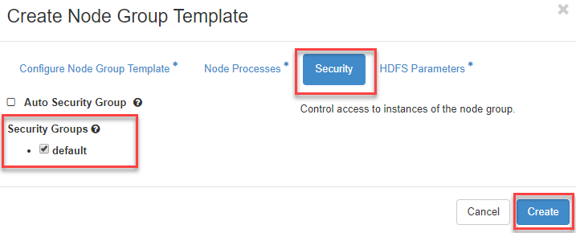

# How to Create Node Group templates and a Cluster Template

Before launching a spark cluster, you have to create node group templates and a cluster template first. A node group template contains configuration for a node in the cluster. A node group template includes configuration for running processes and VM specifications such as, Spark processes, number of CPUs, amount of memory and storage capacity.  A cluster consists of one or more nodes. Each node is instantiated from a node group template. A single cluster can be composed of multiple node groups. For example, a node group that stores data should have large disk storage; while another node group that performs computation should have many number of cores. Therefore, a cluster template contains a list of node group templates plus configurations that are applied to the whole cluster, e.g. HDFS or Spark parameters. Please follow the instructions below on how to create node group templates and a cluster template.

## Create Node group templates

1. Navigate to the "Data Processing" menu, then click on the "Clusters" panel and then the "Node Group Templates" tab.

   

2. This example, we will create two node group templates which consists of master and worker node group template. The master node runs spark master, HDFS name node, Jupyter and also ganglia master service. The worker node runs spark worker, HDFS data node and also ganglia slave service. In order to achieve the requirements, please follow the below instructions.

   #### **Create node group template named "master"** 

   2.1 On Clusters panel, click on the "Create Template" button at the top right.

   

   2.2 Choose KitWai Plugin name and Version 1.2 from the dropdowns and click "Next" button.

   

   2.3 On "Configure Node Group Template" tab. Fill out Template name as your desired and choose "OpenStack Flavor" to determine the size (VCPUs, memory and storage) of all launched VMs,  "Availability Zone" and "Floating IP Pool" which specifies public IP pool for each node group from dropdowns as shown image below. 

   

   

   2.4 Switch to the "Node Processes" tab and choose which processes should be run for spark master instance that are spawned from this Node Group Template as shown image below.

   

   2.5 Switch to "Security" tab, select "Security Groups" as default for applying firewall rules to all instances and click on "Create" button to finish creating the node group template.

   

   2.6 You will see master node group lists in Clusters panel after creating the node group has finished.

   

   

   #### **Create another one node group template named worker node**

   2.7 Repeat in step 2.1 to 2.3

   2.8 On the "Node Processes" tab, choose which processes should be run for spark worker instance that are spawned from this Node Group Template as shown image below.

   

   2.9 Repeat in step 2.5 for choosing security group.

   2.10 You will see worker node group template lists in Clusters panel after creating the node group has finished.

   

## Create a Cluster template

1. Navigate to the "Data Processing" tab, then click on the "Clusters" panel and finally the "Cluster Templates" tab.

   

2. From that page, click on the "Create Template" button at the top right.

3. Choose Plugin name as KitWai and Version 1.2 from the dropdowns and click on "Next" button.

   

4. Under the "Details" tab, fill out template a name as your desired.

   

5. Switch to "Node Groups" tab,  We can choose created node group template from "Select a Node Group Template to add" dropdown list and click on "+" button for adding them into cluster template. We can adjust number of instance in each node group template by click on "+" and "-" button. 

   

6. Switch to "HDFS Parameters" tab, set dfs.replication value to "1". The dfs.replication factor have to less than or equal to number of spark worker node. Click on "Create" button to finish creating cluster template.

   

7. The Cluster template is listed on Cluster panel, the template has been successfully created.

   

