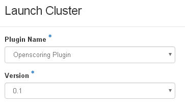
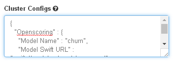

# How to Deploy a Spark ML model

After the model is built and exported into PMML file, users can deploy the model in production. In this tutorial, we'll demonstrate how to use KitWai to launch and deploy a PMML model on an Openscoring cluster.

An Openscoring cluster consists of a HAProxy and a number of Openscoring nodes. The HAProxy is exposed to the Internet and balance the prediction request to all Openscoring nodes.

## 1. Upload the PMML model into Swift storage
Assume a PMML model in /tmp/churn.pmml. Refer to [Train a Machine Learning Model with Jupyter Notebook](/jupyter/jupyter.md) for building such a model.

Open a console terminal in Jupyter notebook. Use swift command to upload the model.

```shell
cd /tmp
swift --insecure upload model churn.pmml
churn.pmml
```

The option --insecure is used for our self-signed certificate. Users may see some InsecureRequestWarning messages which can be ignored.

```
/usr/lib/python2.7/site-packages/urllib3/connectionpool.py:858: InsecureRequestWarning: Unverified HTTPS request is being made. Adding certificate verification is strongly advised. See: https://urllib3.readthedocs.io/en/latest/advanced-usage.html#ssl-warnings
  InsecureRequestWarning)
```

Check if the model is uploaded.

```shell
cd /tmp
swift --insecure list model
churn.pmml
```

## 2. Launch an Openscoring cluster with a PMML model

Similar to [Launch a Spark Cluster](/launchcluster/launchcluster.md) except the following steps

Select Openscoring plugin

   

Select _openscoring_ Cluster Template and _Openscoring 1.4.0_ Base Image. By this template, one HAProxy and one Openscoring node will be launched.

Add the following Cluster Configs in Launch Cluster. These configs is specific to the PMML model that has been uploaded into Swift previously. The configs must be expressed in JSON format. Note that, the Cluster Configs can be set when creating a Cluster Template too.

```json
{
  "Openscoring" : {
    "Model Name" : "churn",
    "Model Swift URL" : "swift://model.sahara/churn.pmml"
  }
}
```

   


After the Openscoring cluster has been launched, find the public (floating) IP address of the HAProxy node.

## 3. Evaluate the model

On the client machines, install openscoring python client library.

```shell
pip install openscoring
```

Then, execute the following code.

```python
from openscoring import Openscoring
import pandas as pd
from io import StringIO

test_data = """State,Account length,Area code,International plan,Voice mail plan,Number vmail messages,Total day minutes,Total day calls,Total day charge,Total eve minutes,Total eve calls,Total eve charge,Total night minutes,Total night calls,Total night charge,Total intl minutes,Total intl calls,Total intl charge,Customer service calls,Churn
LA,117,408,No,No,0,184.5,97,31.37,351.6,80,29.89,215.8,90,9.71,8.7,4,2.35,1,False
IN,65,415,No,No,0,129.1,137,21.95,228.5,83,19.42,208.8,111,9.4,12.7,6,3.43,4,True
"""

df = pd.read_csv(StringIO(test_data))
os = Openscoring("http://ip_address_of_haproxy/openscoring")
result = os.evaluateCsv('churn',df)

print (result)
```

The result returned from Openscoring is of DataFrame type.
