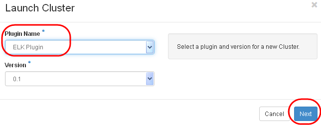

# Launch an ELK cluster

Assume a keypair has been imported; otherwise follow the instructions [here](https://kitwaicloud.github.io/login/login.html).

For launching a spark cluster for running Big Data Analytics jobs on KitWai platforms, please follow the instructions below on how to launch a spark cluster.

1. Click on Data Processing menu and Clusters menu which is under Data Processing menu, respectively. Then, click on Clusters tab and click on Launch Cluster button.

   

   ​

2. On Launch Cluster page, select plugin name as ELK Plugin. Then, click on Next button.

   

   ​

3. On Launch Cluster page, enter cluster name, e.g "demo" and select your keypair. Ensure that the Cluster Template is set to elk-template. and Base Image is set to "ELK 6.2.4 ..." Then, click on Launch button.

   

4. While an ELK cluster is launching, please wait until cluster status has changed to Active and also health status has changed to Green bar (3-5 minutes).

   

   ​
5. Congratulation, the ELK cluster is ready for use.

   Each cluster from the elk-template consists of 2 master/data nodes with 1 client only node. The master node also runs cerebro web UI. The client nodes run kibana and grafana dashboards.
