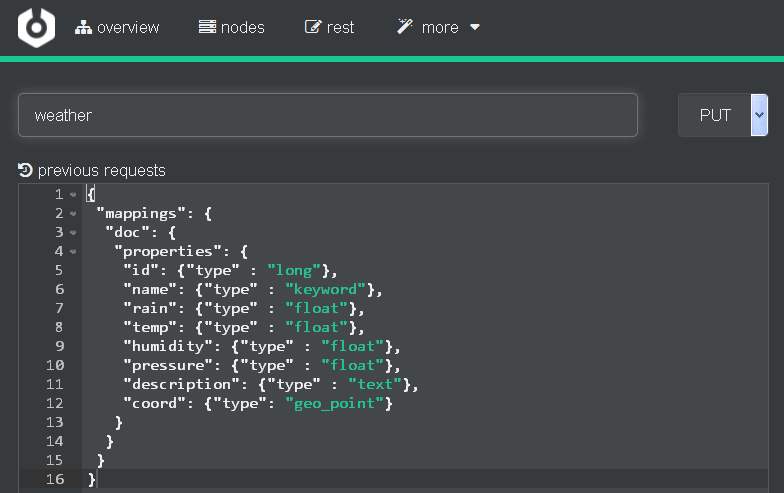
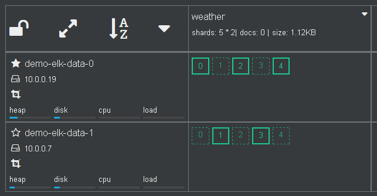
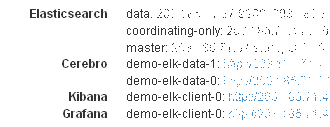
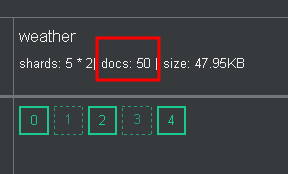

# Load Data into Elasticsearch

[OpenWeatherMap](https://openweathermap.org/) provides the current and forecast weather information. Here, we'll use logstash to ingest data from  into elasticsearch.


## Prerequisites
User must create an account on OpenWeatherMap and have an APPID. We'll use free service of OpenWeatherMap.

## 1. Create an index mappings (database schema) on ELK cluster
In the Cerebro Web UI, click on the _rest_ menu.

   

Enter the index name "_weather_" and select "_PUT_". Copy and paste the following mappings into the textbox as shown in the figure below.
```json
{
 "mappings": {
  "doc": {
   "properties": {
    "id": {"type" : "long"},
    "name": {"type" : "text"},
    "rain": {"type" : "float"},
    "temp": {"type" : "float"},
    "humidity": {"type" : "float"},
    "pressure": {"type" : "float"},
    "description": {"type" : "text"},
    "coord": {"type": "geo_point"}
   }
  }
 }
}
```
The id and name are the station ID and name, respectively. The field coord is the location (lat/long) of the station. We define the mappings for relevant fields. Other fields are automatically detected by Elasticsearch.

   

Scroll down to the bottom of the page, and click . Then, check if the mappings is successfully created in the right textbox.

   

Go back to the Cerebro overview page. Now an empty index (docs: 0) is created.

   

## 2. Login to the the client (coordinating-only) node.
Note that login to any node would work, actually.

Find the IP address of the client node. Click on the cluster name to see the general information of the cluster.
   

The IP adress and port of services on all nodes are shown. Take note of the IP address of the client node shown in _coordinating-only_.
   

Use ssh tool to login to the client node. Remember to use the matching keypair.
```shell
ssh centos@<CLIENT_IP>
[centos@demo-elk-client-0 ~]$
```

## 3. Create logstash config
Create the weather.conf file for logstash. There are three sections: input, filter and output, which defines how to get weather data from the OpenWeatherMap service, transform them and load into Elasticsearch.

```shell
input {
 http_poller {
   urls => {
     myurl => "http://api.openweathermap.org/data/2.5/find?lat=13.75&lon=100.51&appid=APPID&units=metric&cnt=50"
   }
   schedule => { cron => "*/15 * * * * UTC"}
   codec => "json"
 }
}

filter {
  split {
    field => "list"
  }

  ruby { # copy (nested) fields in list to root
    code => "
      event.get('list').each {|k, v|
        event.set(k,v)
      }
      event.remove('list')
    "
  }
  date { # convert timestamp to date
    match => ["dt", "UNIX"]
    timezone => "Asia/Bangkok"
  }
  mutate {
    copy => {
      "[main][temp]" => "temp"
      "[main][pressure]" => "pressure"
      "[main][humidity]" => "humidity"
      "[weather][0][description]" => "description"
    }
    rename => {
      "[coord][Lat]" => "[coord][lat]"
      "[coord][Lon]" => "[coord][lon]"
    }
    remove_field => ["host", "calctime", "count", "main", "weather"]
  }
}

output {
  elasticsearch {
    hosts => ["http://localhost:9200"]
    document_id => "%{id}_%{dt}"
    index => "weather"
  }

  stdout { codec => dots }
}
```

In this example, the input section defines the http poller to retrieve the current weather from OpenWeatherMap every 15 minutes. Replace _APPID_ with yours. Due to the free service, it allows up to 50 stations around the center point. The center in the example is located at Bangkok. The filter section defines the transformation of OpenWeaterMap data for indexing in ELK cluster. Shortly, it extracts nested fields into the root and creates timestamp. The output section load each station data into Elasticsearch. Each document has an ID set to stationID_timestamp. Note that these data is updated with 30-min interval.

## 4. Run logstash

Run the following command. Keep it running in background.

```shell
/opt/logstash/bin/logstash -w 1 -f weather.conf &
```
After 15 min, the first set of data will be injected into Elasticsearch.

   
