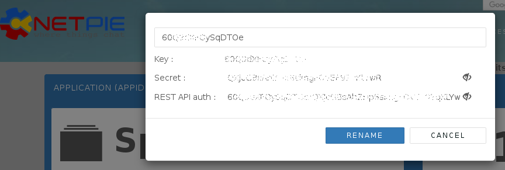

# Connect to NETPIE IoT Cloud Platform
We show how to connect to [NETPIE](https://netpie.io/) cloud platform for Internet of Things. Users are required to have or sign up for a NETPIE account. Follow the instructions given on the web page to create an application. Find the APPID, APPKEY and APPSECRET.



## Subscribe data from NETPIE and send to Elasticsearch
Suppose that we publish data to topic _mytopic_ using curl command as shown below. The APPID needs to be substituted with your application ID already created in NETPIE. The topic _mytopic_ can be changed to anything we want. The authentication is done by the option -u APPKEY:APPSECRET which can be obtained from NETPIE account. The data consists of ID, moisture, temperature and light data in json format.

```shell
curl -X PUT "http://api.netpie.io/topic/APPID/mytopic" -u APPKEY:APPSECRET -d '{"ID": "sensor01", "Moisture": 80.0, "Temperature": 31.5, "Light": 750.0}'
```

Before storing data into Elasticsearch, it is recommended that the schema of _sensor_ index in Elasticsearch is pre-defined by the following mappings.

```json
{
 "mappings": {
  "doc": {
   "properties": {
    "ID": {"type" : "keyword"},
    "Temperature": {"type" : "float"},
    "Moisture": {"type" : "float"},
    "Light": {"type" : "float"}
   }
  }
 }
}
```
Next, we create a configuration file, netpie.conf, for logstash.
We'll use MQTT input plugin of logstash to subscribe data from NETPIE as shown below. The MQTT plugin requires several parameters such as host, client_id, username and password from NETPIE, as explained later. In this configuration, the data must be published in json format. The data will be parsed and sent to _sensor_ index as well as displayed on the screen. The topic must match both the APPID and _mytopic_ with the above curl command.

```shell
# netpie.conf
input {
  mqtt {
    host => "HOST"
    port => 1883
    client_id => "CLIENT_ID"
    username => "USERNAME"
    password => "PASSWORD"
    topic => "/APPID/mytopic"
    codec => "json"
  }
}

filter {
  mutate {
    remove_field => ["host"]
  }
}

output {
  elasticsearch {
    hosts => "http://localhost:9200"
    index => "sensor"
  }
  stdout {}
}
```

For other required parameters of MQTT plugin, we will create a new microgear "thing" and convert the configuration of this "thing" to the MQTT parameters. First, we install [microgear- python](https://github.com/netpieio/microgear-python) client library.

```shell
pip install microgear
```

Next, create a new microgear "thing" by running the following python program. Replace the APPID, APPKEY and APPSECRET obtained from your NETPIE account. Note that if there exists a  microgear-APPKEY.cache file in the current directory, the program will just use the data from the existing microgear thing. Use the output of the program for MQTT plugin paramters.

```python
import microgear.client as mc
import time

appid = 'APPID'
appkey = 'APPKEY'
appsecret = 'APPSECRET'

mc.create(appkey,appsecret,appid,{'debugmode': True})
microgear = mc.microgear
times = 1
while not microgear.accesstoken:
    mc.get_token()
    time.sleep(times)
    times = times+10

mqtt_broker = microgear.accesstoken["endpoint"].split("//")[1].split(":")
mqtt_clientid = microgear.accesstoken["token"]
mqtt_username = microgear.gearkey+"%"+str(int(time.time()))
mqtt_password = mc.hmac(microgear.accesstoken["secret"]+"&"+microgear.gearsecret,microgear.accesstoken["token"]+"%"+mqtt_username)

print ("Host: " + mqtt_broker[0])
print ("Port: " + mqtt_broker[1])
print ("ClientId: " + mqtt_clientid)
print ("Username: " + mqtt_username)
print ("Password: " + mqtt_password)
```

Run logstash

```shell
logstash -f netpie.conf
```

The output of logstash looks like:
```javascript
{
  "@timestamp" => 2018-08-22T07:24:16.259Z,
    "@version" => "1",
    "Moisture" => 80.0,
          "ID" => "sensor01",
       "Light" => 750.0,
       "topic" => "/APPID/mytopic",
 "Temperature" => 31.5
}
```

## Query data from NETPIE feed API
We show how to use logstash to continuously query data from feed API. The logstash configuration is shown below. The input http_poller plugin repeatedly queries the feed API at every midnight UTC. For each  json response object, the filter unfolds the arrays and nested fields into multiple flat json objects. The document ID and @timestamp fields are created from data. Unnecessary files are removed.

```shell
input {
 http_poller {
   urls => {
     myurl => "http://api.netpie.io/feed/feedfeed?apikey=pskfmxRGSfUk4lEbHIsN2MG6d7zIiCVF&granularity=1minutes&since=24hours"
   }
   schedule => { cron => "0 0 * * * UTC"}
   codec => "json"
 }
}

filter {
  mutate {
    remove_field => ["lastest_data"]
  }

  split {
    field => "data"
  }

  split {
    field => "[data][values]"
  }

  mutate {
    add_field => {
      "doc_id" => "%{feedid}_%{[data][values][0]}"
      "%{[data][attr]}" => "%{[data][values][1]}"
    }
  }

  date { # convert @timestamp to the last updated time from data
    match => ["[data][values][0]", "UNIX_MS"]
  }

  mutate {
    convert => {
      "Temperature" => "float"
      "Moisture" => "float"
      "Light" => "float"
    }
    remove_field => ["data", "since", "granularity"]
  }
}

output {
  elasticsearch {
    hosts => ["http://localhost:9200"]
    document_id => "%{doc_id}"
    action => "update"
    doc_as_upsert => true
    index => "sensor"
  }

  stdout { }
}
```
We'll let the schema of the _sensor_ index automatically be created but it is preferable to have the schema created manually if possible. (Try it.)

Now, we can use curl to send data to feed. Substitute _sensor1_ and _APIKEY_ with your feed ID and feed API key.

```shell
curl -X PUT "http://api.netpie.io/feed/sensor1?apikey=APIKEY&data=Moisture:80.0,Temperature:31.5,Light:750.0"
```

The output of logstash looks like below. Each json object has only one field of temperature, moisture, or light field. For documents with the same doc_id, existing fields are updated and new fields are added into the same document.

```javascript
{
    "Temperature" => 31.5,
    "description" => "",
         "doc_id" => "sensor1_1534926557265",
         "feedid" => "sensor1",
       "@version" => "1",
     "@timestamp" => 2018-08-22T08:29:17.265Z
}
```
