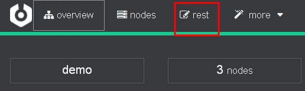
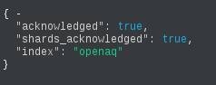
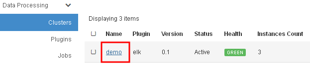
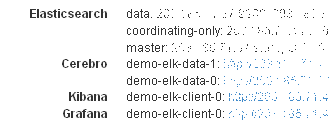
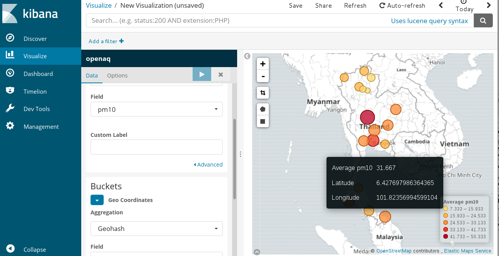
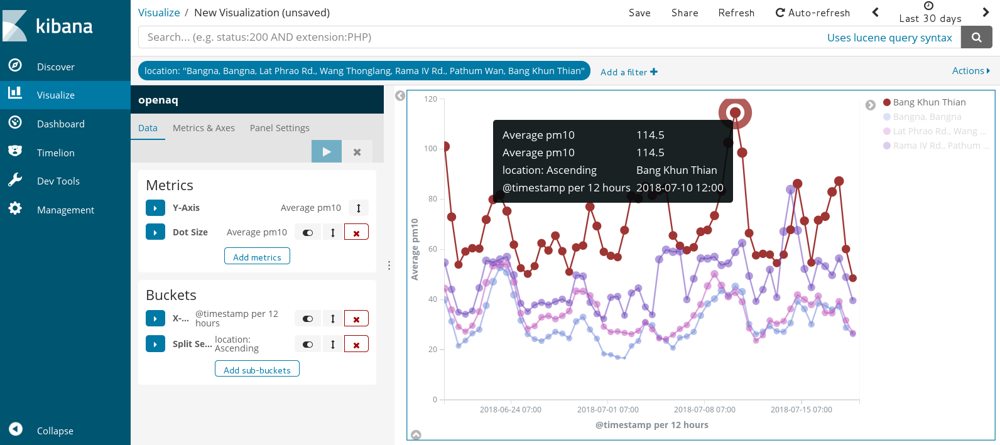

# Work with Historical and Real-Time Air Quality Data from OpenAQ

We show how to import historical data and real-time air quality data from [OpenAQ](https://openaq.org/) into Elasticsearch.

## 1. Create an index mappings (database schema) on ELK cluster
In the Cerebro Web UI, click on the _rest_ menu.

   

Enter the index name "_openaq_" and select "_PUT_". Copy and paste the following mappings into the textbox as shown in the figure below. The doc_id is the generated id for the measurements at each station and in each point in time. More information can be found in [OpenAQ FAQ](https://github.com/openaq/openaq-info/blob/master/FAQ.md).
```json
{
 "mappings": {
  "doc": {
   "properties": {
    "doc_id": {"type" : "keyword"},
    "country": {"type" : "keyword"},
    "city": {"type" : "keyword"},
    "location": {"type" : "keyword"},
    "bc": {"type" : "float"},
    "co": {"type" : "float"},
    "no2": {"type" : "float"},
    "o3": {"type" : "float"},
    "pm10": {"type" : "float"},
    "pm25": {"type" : "float"},
    "so2": {"type" : "float"},
    "coordinate": {"type": "geo_point"}
   }
  }
 }
}
```

Scroll down to the bottom of the page, and click . Then, check if the mappings is successfully created in the right textbox.

   


## 2. Login to the the client (coordinating-only) node.
Note that login to any node would work, actually.

Find the IP address of the client node. Click on the cluster name to see the general information of the cluster.

   

The IP adress and port of services on all nodes are shown. Take note of the IP address of the client node shown in _coordinating-only_.

   

Use ssh tool to login to the client node. Remember to use the matching keypair.
```shell
ssh centos@<CLIENT_IP>
[centos@demo-elk-client-0 ~]$
```

## 3. Import the historical data in CSV format
Download the historical data from OpenAQ. There are many [ways](https://github.com/openaq/openaq-info/blob/master/FAQ.md#access). Choose the method that suit you the most. Some methods limits the maximum number of records for each download. Copy the file(s) to the client node. A sample of the file in CSV format is shown below.

```
location,city,country,utc,local,parameter,value,unit,latitude,longitude,attribution
"Intarapitak Rd., Thon Buri",Bangkok,TH,2018-07-18T14:00:00.000Z,2018-07-18T21:00:00+07:00,o3,0.006,ppm,13.727559345309,100.48660439296,"[{""name"":""Pollution Control Department"",""url"":""http://www.aqmthai.com/index.php""}]"
"Rama IV Rd., Pathum Wan",Bangkok,TH,2018-07-18T14:00:00.000Z,2018-07-18T21:00:00+07:00,pm10,47,µg/m³,13.729830133162,100.53649416504,"[{""name"":""Pollution Control Department"",""url"":""http://www.aqmthai.com/index.php""}]"
"Lat Phrao Rd., Wang Thonglang",Bangkok,TH,2018-07-18T14:00:00.000Z,2018-07-18T21:00:00+07:00,co,0.6,ppm,13.79263500923,100.59607755884,"[{""name"":""Pollution Control Department"",""url"":""http://www.aqmthai.com/index.php""}]"
```

Then, create the openaq-batch.conf file for logstash as shown below.

```shell
input {
  stdin { }
}

filter {
  csv {
    separator => ","
    columns => ["location", "city", "country", "utc", "local", "parameter", "value", "unit", "latitude", "longitude", "attribution"]
    convert => {
      "value" => "float"
      "latitude" => "float"
      "longitude" => "float"
    }
  }

  if [location] == "location" {
    drop { }
  }

  date { # replace @timestamp to utc
    match => ["utc", "ISO8601"]
  }

  mutate {
    add_field => {
      "%{parameter}" => "%{value}"
      "[coordinate][lat]" => "%{latitude}"
      "[coordinate][lon]" => "%{longitude}"
    }

    remove_field => ["utc", "local", "unit", "parameter", "value", "latitude", "longitude", "attribution", "message", "host"]
  }

  ruby {
    code => "
      require 'digest/md5';
      event.set('doc_id', Digest::MD5.hexdigest(event.get('country') + event.get('city') + event.get('location')) + '_' + event.get('@timestamp').to_s)
    "
  }

}

output {
  elasticsearch {
    hosts => ["http://localhost:9200"]
    document_id => "%{doc_id}"
    action => "update"
    doc_as_upsert => true
    index => "openaq"
  }
}
```

In this example, logstash reads input from stdin. We generate the document ID from the hash of station location, city and country, appended with the timestamp. We set the output model to upsert (insert or update).

Run logstash to read and load the file into Elasticsearch.

```shell
logstash -f openaq-batch.conf < filename.csv
```

The example JSON output for each measurement looks like:
```shell
{
      "@version" => "1",
        "doc_id" => "3f00f9510bf78c9cfb53ec972e1dd602_2018-02-22T00:00:00.000Z",
           "no2" => "0.053",
      "location" => "Aranyaprathet, Aranyaprathet",
    "coordinate" => {
        "longitude" => 102.50621,
         "latitude" => 13.689029
    },
    "@timestamp" => 2018-02-22T00:00:00.000Z,
          "city" => "Sa Kaeo",
       "country" => "TH"
}
```

## 4. Ingest the real-time data
To get the real-time data, we use the [OpenAQ API](https://docs.openaq.org/#api-Latest).

Create openaq-realtime.conf file as follows. As the data is updated every hour, we set Logstash to periodically get the data every 30 min.

```shell
input {
 http_poller {
   urls => {
     myurl => "https://api.openaq.org/v1/latest?country=TH"
   }
   schedule => { cron => "*/30 * * * * UTC"}
   codec => "json"
 }
}

filter {
  split {
    field => "results"
  }

  split {
    field => "[results][measurements]"
  }

  date { # convert @timestamp to the last updated time from data
    match => ["[results][measurements][lastUpdated]", "ISO8601"]
  }

  mutate {
    copy => {
      "[results][city]" => "city"
      "[results][location]" => "location"
      "[results][country]" => "country"
      "[results][coordinates]" => "coordinate"
    }
    add_field => {
      "%{[results][measurements][parameter]}" => "%{[results][measurements][value]}"
    }

    remove_field => ["host", "results", "meta"]
  }

  mutate {
    # Must be in a separate mutate block
    rename => {
      "[coordinate][latitude]" => "[coordinate][lat]"
      "[coordinate][longitude]" => "[coordinate][lon]"
    }
  }

  ruby {
    code => "
      require 'digest/md5';
      event.set('doc_id', Digest::MD5.hexdigest(event.get('country') + event.get('city') + event.get('location')) + '_' + event.get('@timestamp').to_s)
    "
  }

}

output {
  elasticsearch {
    hosts => ["http://localhost:9200"]
    document_id => "%{doc_id}"
    action => "update"
    doc_as_upsert => true
    index => "openaq"
  }
  stdout { codec => dots }
}
```

Run the following command. Keep it running.

```shell
/opt/logstash/bin/logstash -w 1 -f openaq-realtime.conf
```

## 5. Explore and visualize data

   

   
