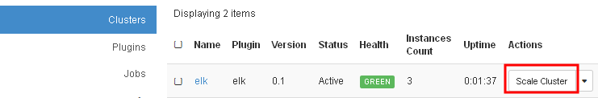
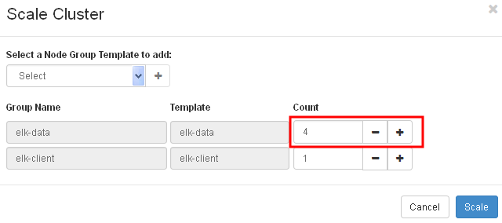
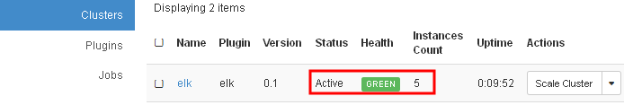
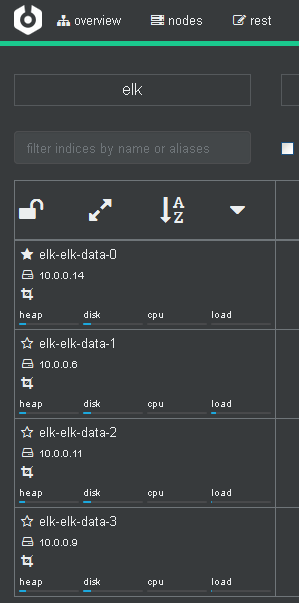

# Scale an ELK cluster

Elasticsearch clusters can be scaled out for more storage space or performance.

1. On the Clusters Page, click on the Scale Cluster button at the right end of the cluster.

   

   ​

2. For a specific node group, click on -/+ button to adjust the number of nodes. This number will be the target number of nodes in that node group after scaled. Then, click on Scale button.

   

Note that, the current ELK plugin doesn't support scale-in.

Wait until the cluster status is changed from Scaling to Active.

   

3. Check if the new nodes successfully joined the cluster from Cerebro web UI

   
