# Running Integrated Meta-omic Pipeline (IMP) for Bioinformatic Analysis

[IMP](http://r3lab.uni.lu/web/imp/) is a workflow engine to automate integrated analysis of the multi-omic data. IMP can be run in a docker container to ensure that it can run  with all dependency libraries under isolated environment. Here, we show how to launch a VM instance with IMP on KitWai Cloud platform.

## 1. First, a user must have an account and imported keypairs.
Follow the instructions [here](../login/login.md) if necessary.

## 2. Launch an IMP instance.

2.1. Click on the Project/Compute/Instances menu and then click on the "Launch Instance" button.
   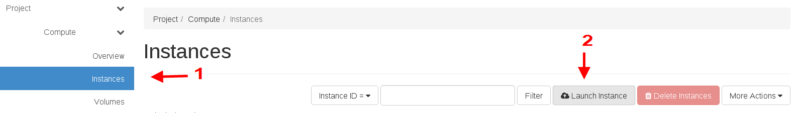

2.2. The Launch Instance will pop up. Input the instance name, e.g. _test_. The instance name must not be duplicated with other instances.
   ​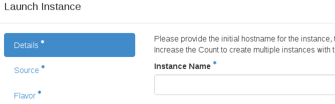

2.3. Then, select the IMP image source. Be sure to set Create New Volume to NO.
   ​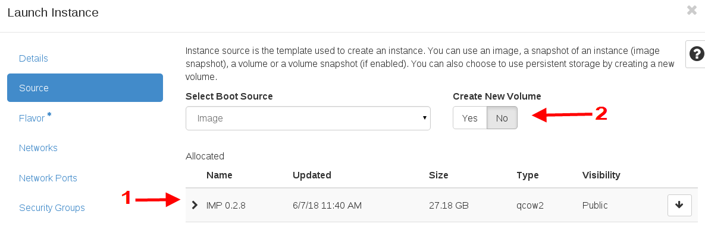

2.4. Next, select the instance size (flavor) by clicking at the arrow up button. Each flavor is named by the number of CPU cores, memory and harddisk size. For example, c8m20d50 means 8 CPU cores, 20 GB memory, and 50 GB harddisk. The flavor depends on the size of analysis task. For a small task c8m20d50 should be large enough. Finally, click on the Launch Instance button.

   ​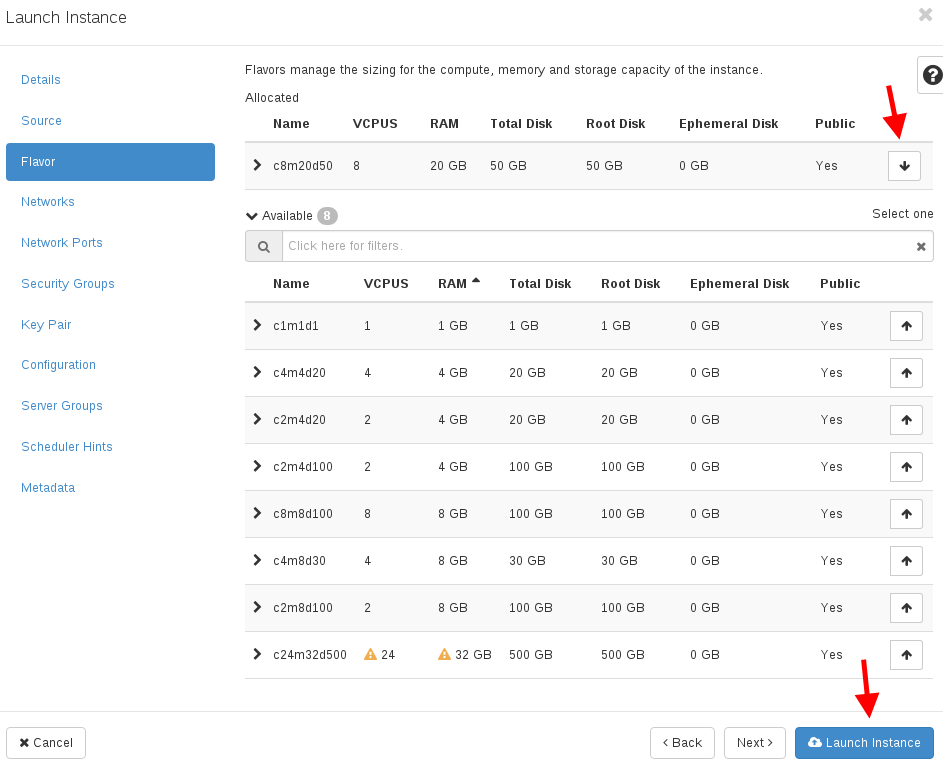

## 3. Check the status of the instance being launched and wait until the instance is completely launched.   ​

   ​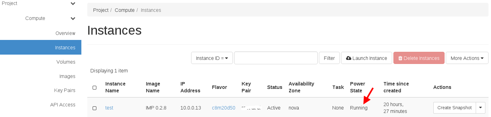

## 4. Assign a public (called floating) IP address to your VM instance

4.1. click on drop down list of your VM and select “Associate Floating IP” menu. The floating IP lets your VM be accessible from the your network.

   ​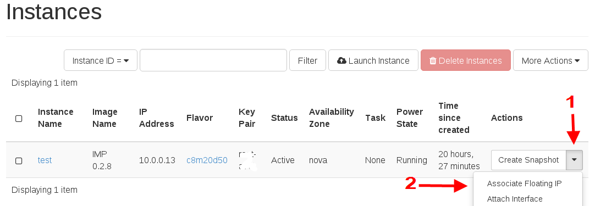

4.2. Click at plus button to allocate a new floating IP.

   ​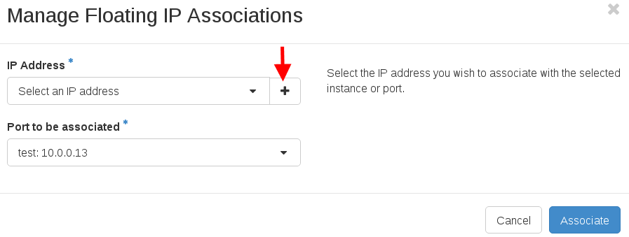

4.3. Click at Allocate IP button.

   ​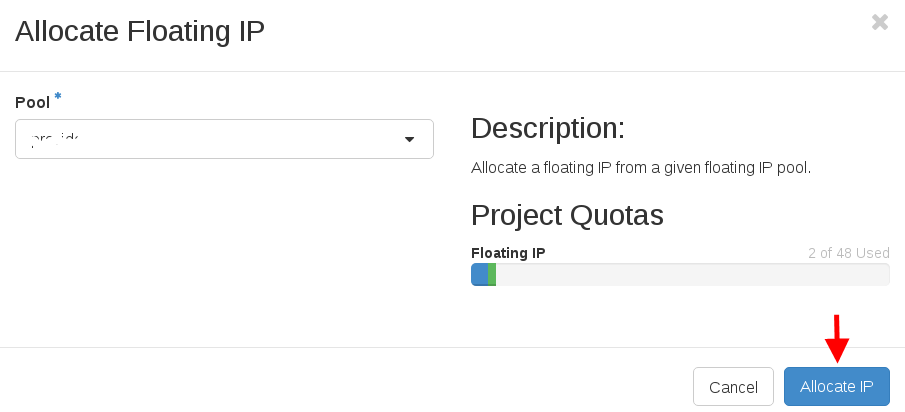

4.4. Now, you obtain a floating IP which is shown in IP Address box. Then, click at Associate button.

   ​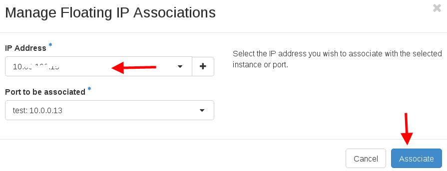

4.5. The floating IP is already assigned to your VM instance which is shown in the Instances page. Take note of your floating IP. You will have to use this floating IP to login to the VM.

   ​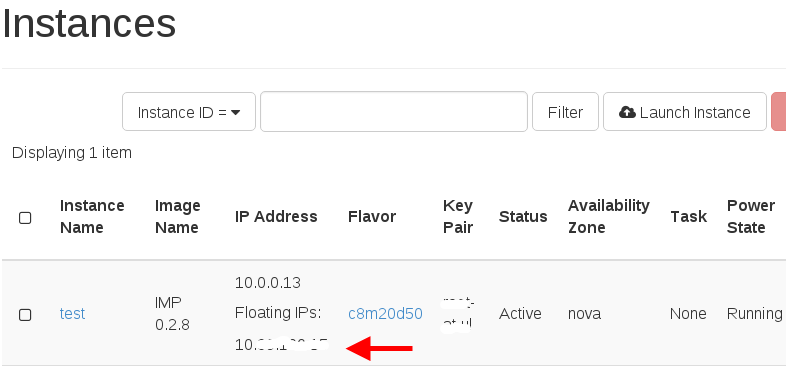

## 5. Login to your VM and submit a job
Use secure shell (linux) to login to the VM. The user name is _centos_ and VM ip address is the floating IP.

```shell
ssh centos@<your_floating_IP>
```

In home directory, there are three folders.
```shell
[centos@test ~]$ ls
IMP  imp-db  small-db
```
Folder IMP store the IMP source code from [https://git-r3lab.uni.lu/IMP/IMP.git](https://git-r3lab.uni.lu/IMP/IMP.git). Folder imp-db is the initialized database from `imp init` command. Folder small-db is a small database for testing from the config file /home/centos/IMP/test/default.conf.json.

Run a small analysis job.
```shell
cd IMP/test
impy --threads 8 --memtotal 16 --memcore 2 -e IMP_SUDO=sudo -d /home/centos/small-db -c /home/centos/IMP/test/default.conf.json run -m mg.r1.fq -m mg.r2.fq -t mt.r1.fq  -t mt.r2.fq
```
The job should spend around 1.5-2 hours to finish.

## 6. Terminiate IMP instance
After the instance is no longer used, it should be terminated. On the Instance page, click on the drop down list and select Delete Instance.

   ​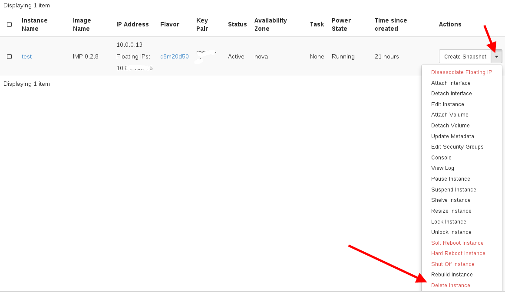
