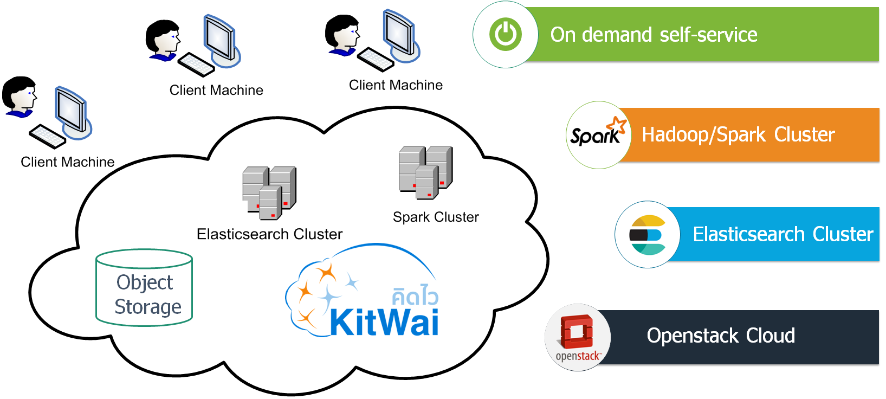

# KitWai Instruction Manual

KitWai is a software stack for cloud-based big data analytics platform. It provides self-configured, on-demand, and scalable computing resources for big data processing.

This instruction manual provides an illustrative examples to use KitWai cloud computing platform. It requires a basic knowledge of Linux commands plus some background knowledge on data mining/machine learning.

For more information, contact kitwai _at_ nectec _dot_ or _dot_ th

## Basics
This section provides a step-by-stop from launching a cluster to training and deploying an ML model using Spark.
1. [Overview](overview.md)
2. [Login to KitWai and Import KeyPair](login/login.md)
3. [Launch a Spark Cluster](launchcluster/launchcluster.md)
4. [Verify and Check Spark Cluster Status](status/status.md)
5. [Train a Machine Learning Model with Jupyter Notebook](jupyter/jupyter.md)
6. [Terminate Spark Cluster after Use](terminate/terminate.md)

## Storing and exploring data with ELK stack
Use the ELK (Elasticsearch Logstash and Kibana) stack to store, explore and visualize data.
1. [Launch an ELK Cluster](elk/launchcluster.md)
2. [Scale an ELK Cluster](elk/scale_elk.md)
3. [Example Usage](elk/weather.md)
<!--- 2. [Load Data](elk/loaddata.md) --->
<!--- 3. [Explore Data with Kibana](elk/kibana.md) --->
<!--- 4. [Create a Dashbard in Grafana](elk/grafana.md) --->

## Specific Tasks
- [Running Integrated Meta-omic Pipeline (IMP) for Bioinformatic Analysis](imp/imp.md)

## Other Tasks
- [Working with Data in Swift Object Storage](swift/swift.md)
- [Product Recommendation Example](als/als.md)
- [How to Deploy a Spark ML Model](deploy/deploy.md)
- [Deep Learning with DeepLearning4J](dl4j/dl4j.md)
- [Deep Learning with TensorFlow on Spark](tensorflow_on_spark/tensorflow_on_spark.md)
- [How to Create Node Group Templates and a Cluster Template](create_template/create_template.md)
- [Using API Libraries to Operate KitWai](apis/apis.md)
- [SparkSQL and JDBC Connnection](sparksql/sparksql.md)
- [Using Zeppelin Notebook for Spark Programming in Scala](zeppelin/zeppelin.md)
- [Launch a Flink Cluster](launchflink/launchflink.md)

## Further Readings

- [OpenStack Dashboard User Documentation](https://docs.openstack.org/horizon/pike/user/)
- [OpenStack Sahara User Documentation](https://docs.openstack.org/sahara/latest/user/index.html)
