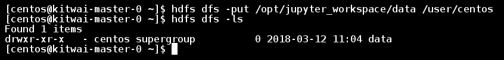

# Connect to Jupyter Notebook

Jupyter is a common web-based notebook for users to interactively write python programs. In our demo Spark cluster template, Jupyter has been pre-configured to connect to the Spark cluster.

In the following, we show how to use Jupyter to run a small machine job on Spark cluster interactively.

1. Open the Jupyter notebook. Connect web browser to  http://&lt;masterIP&gt;:8888 or click on the Jupyter Notebook link in the cluster info page as shown below.

   


Then, users will see the first page of Jupyter notebook few examples.


Users can create a new notebook, upload a notebook, or open a shell console.


2. Copy sample dataset to HDFS. First, open a shell console

```shell
hdfs dfs -put /opt/jupyter_workspace/data /user/centos
hdfs dfs -ls
```
   


   ​
