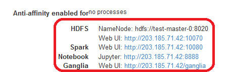
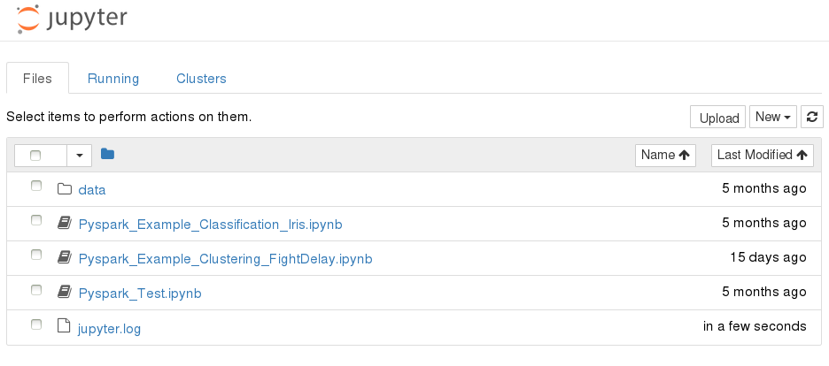
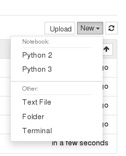
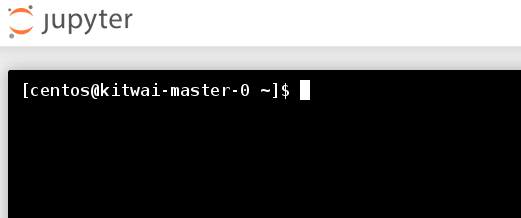
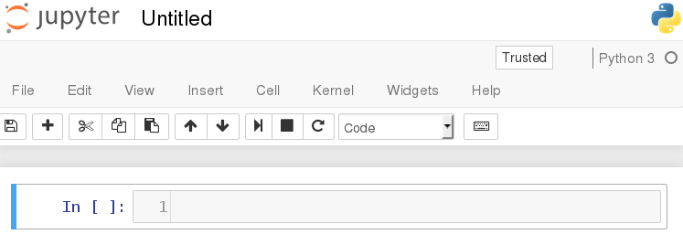
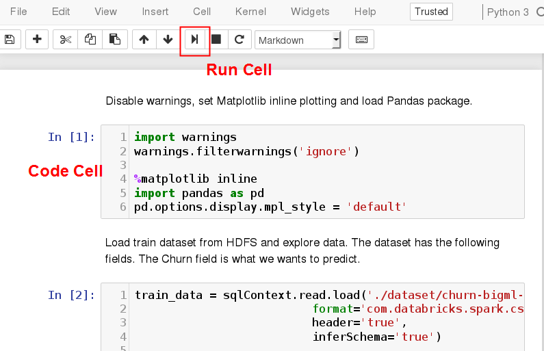
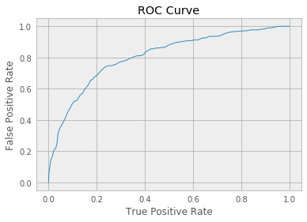

# Connect to Jupyter Notebook

Jupyter is a common web-based notebook for users to interactively write python programs together with documents. In our demo Spark cluster template, Jupyter has been pre-configured to connect to the Spark cluster.

In the following, we show how to use Jupyter to run a small machine job on Spark cluster interactively. Particularly, we'll use Spark ML library to create a model to predict customer churn in a telecommunication company.

## 1. Open the Jupyter notebook.

Connect web browser to  http://&lt;masterIP&gt;:8888 or click on the Jupyter Notebook link in the cluster info page as shown below.



Then, users will see the first page of Jupyter notebook few examples.





Users can create a new notebook, upload a notebook, or open a shell console.

## 2. Download and copy sample dataset to HDFS.
First, open a shell console. Click New -> Terminal on the Jupyter front page.



Then, execute the following shell commands.

```shell
wget https://github.com/kitwaicloud/kitwaicloud.github.io/raw/master/dataset/churn-bigml-80.csv
wget https://github.com/kitwaicloud/kitwaicloud.github.io/raw/master/dataset/churn-bigml-20.csv
hdfs dfs -mkdir dataset
hdfs dfs -put churn-bigml-80.csv dataset
hdfs dfs -put churn-bigml-20.csv dataset
```
Check the sample dataset in HDFS

```shell
hdfs dfs -ls dataset
Found 1 items
```
This dataset provides details of customers and labels if they cancel the subscription.

## 3. Create a new Python 3 notebook
Click on New -> Python 3.



Then start writing the following python code into Jupyter code cells. Run each code cell sequentially.



## 4. Load and explore data

Disable warnings, set Matplotlib inline plotting and load Pandas package.


```python
import warnings
warnings.filterwarnings('ignore')

%matplotlib inline
import pandas as pd
pd.options.display.mpl_style = 'default'
```

Load train dataset from HDFS and explore data. The dataset has the following fields. The Churn field is what we wants to predict.

```python
train_data = sqlContext.read.load('./dataset/churn-bigml-80.csv',
                        format='com.databricks.spark.csv',
                        header='true',
                        inferSchema='true')

train_data.cache()
train_data.printSchema()
```


  root
  |-- State: string (nullable = true)
  |-- Account length: integer (nullable = true)
  |-- Area code: integer (nullable = true)
  |-- International plan: string (nullable = true)
  |-- Voice mail plan: string (nullable = true)
  |-- Number vmail messages: integer (nullable = true)
  |-- Total day minutes: double (nullable = true)
  |-- Total day calls: integer (nullable = true)
  |-- Total day charge: double (nullable = true)
  |-- Total eve minutes: double (nullable = true)
  |-- Total eve calls: integer (nullable = true)
  |-- Total eve charge: double (nullable = true)
  |-- Total night minutes: double (nullable = true)
  |-- Total night calls: integer (nullable = true)
  |-- Total night charge: double (nullable = true)
  |-- Total intl minutes: double (nullable = true)
  |-- Total intl calls: integer (nullable = true)
  |-- Total intl charge: double (nullable = true)
  |-- Customer service calls: integer (nullable = true)
  |-- Churn: boolean (nullable = true)


Explore the first five rows.

```python
pd.DataFrame(train_data.take(5), columns=train_data.columns)
```

<div>
<style>
    .dataframe thead tr:only-child th {
        text-align: right;
    }

    .dataframe thead th {
        text-align: left;
    }

    .dataframe tbody tr th {
        vertical-align: top;
    }
</style>
<table border="1" class="dataframe">
  <thead>
    <tr style="text-align: right;">
      <th></th>
      <th>State</th>
      <th>Account length</th>
      <th>Area code</th>
      <th>International plan</th>
      <th>Voice mail plan</th>
      <th>Number vmail messages</th>
      <th>Total day minutes</th>
      <th>Total day calls</th>
      <th>Total day charge</th>
      <th>Total eve minutes</th>
      <th>Total eve calls</th>
      <th>Total eve charge</th>
      <th>Total night minutes</th>
      <th>Total night calls</th>
      <th>Total night charge</th>
      <th>Total intl minutes</th>
      <th>Total intl calls</th>
      <th>Total intl charge</th>
      <th>Customer service calls</th>
      <th>Churn</th>
    </tr>
  </thead>
  <tbody>
    <tr>
      <th>0</th>
      <td>KS</td>
      <td>128</td>
      <td>415</td>
      <td>No</td>
      <td>Yes</td>
      <td>25</td>
      <td>265.1</td>
      <td>110</td>
      <td>45.07</td>
      <td>197.4</td>
      <td>99</td>
      <td>16.78</td>
      <td>244.7</td>
      <td>91</td>
      <td>11.01</td>
      <td>10.0</td>
      <td>3</td>
      <td>2.70</td>
      <td>1</td>
      <td>False</td>
    </tr>
    <tr>
      <th>1</th>
      <td>OH</td>
      <td>107</td>
      <td>415</td>
      <td>No</td>
      <td>Yes</td>
      <td>26</td>
      <td>161.6</td>
      <td>123</td>
      <td>27.47</td>
      <td>195.5</td>
      <td>103</td>
      <td>16.62</td>
      <td>254.4</td>
      <td>103</td>
      <td>11.45</td>
      <td>13.7</td>
      <td>3</td>
      <td>3.70</td>
      <td>1</td>
      <td>False</td>
    </tr>
    <tr>
      <th>2</th>
      <td>NJ</td>
      <td>137</td>
      <td>415</td>
      <td>No</td>
      <td>No</td>
      <td>0</td>
      <td>243.4</td>
      <td>114</td>
      <td>41.38</td>
      <td>121.2</td>
      <td>110</td>
      <td>10.30</td>
      <td>162.6</td>
      <td>104</td>
      <td>7.32</td>
      <td>12.2</td>
      <td>5</td>
      <td>3.29</td>
      <td>0</td>
      <td>False</td>
    </tr>
    <tr>
      <th>3</th>
      <td>OH</td>
      <td>84</td>
      <td>408</td>
      <td>Yes</td>
      <td>No</td>
      <td>0</td>
      <td>299.4</td>
      <td>71</td>
      <td>50.90</td>
      <td>61.9</td>
      <td>88</td>
      <td>5.26</td>
      <td>196.9</td>
      <td>89</td>
      <td>8.86</td>
      <td>6.6</td>
      <td>7</td>
      <td>1.78</td>
      <td>2</td>
      <td>False</td>
    </tr>
    <tr>
      <th>4</th>
      <td>OK</td>
      <td>75</td>
      <td>415</td>
      <td>Yes</td>
      <td>No</td>
      <td>0</td>
      <td>166.7</td>
      <td>113</td>
      <td>28.34</td>
      <td>148.3</td>
      <td>122</td>
      <td>12.61</td>
      <td>186.9</td>
      <td>121</td>
      <td>8.41</td>
      <td>10.1</td>
      <td>3</td>
      <td>2.73</td>
      <td>3</td>
      <td>False</td>
    </tr>
  </tbody>
</table>
</div>

Show summary statistics of all fields.


```python
train_data.describe().toPandas()
```

<div>
<style>
    .dataframe thead tr:only-child th {
        text-align: right;
    }

    .dataframe thead th {
        text-align: left;
    }

    .dataframe tbody tr th {
        vertical-align: top;
    }
</style>
<table border="1" class="dataframe">
  <thead>
    <tr style="text-align: right;">
      <th></th>
      <th>summary</th>
      <th>State</th>
      <th>Account length</th>
      <th>Area code</th>
      <th>International plan</th>
      <th>Voice mail plan</th>
      <th>Number vmail messages</th>
      <th>Total day minutes</th>
      <th>Total day calls</th>
      <th>Total day charge</th>
      <th>Total eve minutes</th>
      <th>Total eve calls</th>
      <th>Total eve charge</th>
      <th>Total night minutes</th>
      <th>Total night calls</th>
      <th>Total night charge</th>
      <th>Total intl minutes</th>
      <th>Total intl calls</th>
      <th>Total intl charge</th>
      <th>Customer service calls</th>
    </tr>
  </thead>
  <tbody>
    <tr>
      <th>0</th>
      <td>count</td>
      <td>2666</td>
      <td>2666</td>
      <td>2666</td>
      <td>2666</td>
      <td>2666</td>
      <td>2666</td>
      <td>2666</td>
      <td>2666</td>
      <td>2666</td>
      <td>2666</td>
      <td>2666</td>
      <td>2666</td>
      <td>2666</td>
      <td>2666</td>
      <td>2666</td>
      <td>2666</td>
      <td>2666</td>
      <td>2666</td>
      <td>2666</td>
    </tr>
    <tr>
      <th>1</th>
      <td>mean</td>
      <td>None</td>
      <td>100.62040510127532</td>
      <td>437.43885971492875</td>
      <td>None</td>
      <td>None</td>
      <td>8.021755438859715</td>
      <td>179.48162040510135</td>
      <td>100.31020255063765</td>
      <td>30.512404351087813</td>
      <td>200.38615903976006</td>
      <td>100.02363090772693</td>
      <td>17.033072018004518</td>
      <td>201.16894223555968</td>
      <td>100.10615153788447</td>
      <td>9.052689422355604</td>
      <td>10.23702175543886</td>
      <td>4.467366841710428</td>
      <td>2.764489872468112</td>
      <td>1.5626406601650413</td>
    </tr>
    <tr>
      <th>2</th>
      <td>stddev</td>
      <td>None</td>
      <td>39.56397365334985</td>
      <td>42.521018019427174</td>
      <td>None</td>
      <td>None</td>
      <td>13.61227701829193</td>
      <td>54.21035022086982</td>
      <td>19.988162186059512</td>
      <td>9.215732907163497</td>
      <td>50.95151511764598</td>
      <td>20.16144511531889</td>
      <td>4.330864176799864</td>
      <td>50.780323368725206</td>
      <td>19.418458551101697</td>
      <td>2.2851195129157564</td>
      <td>2.7883485770512566</td>
      <td>2.4561949030129466</td>
      <td>0.7528120531228477</td>
      <td>1.3112357589949093</td>
    </tr>
    <tr>
      <th>3</th>
      <td>min</td>
      <td>AK</td>
      <td>1</td>
      <td>408</td>
      <td>No</td>
      <td>No</td>
      <td>0</td>
      <td>0.0</td>
      <td>0</td>
      <td>0.0</td>
      <td>0.0</td>
      <td>0</td>
      <td>0.0</td>
      <td>43.7</td>
      <td>33</td>
      <td>1.97</td>
      <td>0.0</td>
      <td>0</td>
      <td>0.0</td>
      <td>0</td>
    </tr>
    <tr>
      <th>4</th>
      <td>max</td>
      <td>WY</td>
      <td>243</td>
      <td>510</td>
      <td>Yes</td>
      <td>Yes</td>
      <td>50</td>
      <td>350.8</td>
      <td>160</td>
      <td>59.64</td>
      <td>363.7</td>
      <td>170</td>
      <td>30.91</td>
      <td>395.0</td>
      <td>166</td>
      <td>17.77</td>
      <td>20.0</td>
      <td>20</td>
      <td>5.4</td>
      <td>9</td>
    </tr>
  </tbody>
</table>
</div>

Count churn customers.

```python
train_data.groupBy('Churn').count().show()
```

```
+-----+-----+
|Churn|count|
+-----+-----+
| true|  388|
|false| 2278|
+-----+-----+
```

## 5. Create a Logistic Regression model

Convert categorical fields into numeric fields.

```python
from pyspark.ml.feature import StringIndexer
ipIndexer = StringIndexer(inputCol = 'International plan', outputCol = 'ipIndex')
```
Define feature fields. We choose to ignore some fields as we think they are not relevant.


```python
from pyspark.ml.feature import VectorAssembler

featureCols = ['Account length', 'ipIndex', 'Number vmail messages', 'Total day minutes',
   'Total day calls', 'Total eve minutes', 'Total eve calls', 'Total night minutes', 'Total night calls',
   'Total intl minutes', 'Total intl calls', 'Customer service calls']
assembler = VectorAssembler(inputCols = featureCols, outputCol = 'features')
```

Create a logistic transformer.


```python
from pyspark.ml.classification import LogisticRegression

lr = LogisticRegression(maxIter = 20)
```

Create numeric label field.


```python
from pyspark.sql.types import DoubleType
from pyspark.sql.functions import udf

toNum = udf(lambda v: float(v), DoubleType())
train_data = train_data.withColumn('label', toNum(train_data['Churn'])).cache()
pd.DataFrame(train_data.take(5), columns=train_data.columns)
```

<div>
<style>
    .dataframe thead tr:only-child th {
        text-align: right;
    }

    .dataframe thead th {
        text-align: left;
    }

    .dataframe tbody tr th {
        vertical-align: top;
    }
</style>
<table border="1" class="dataframe">
  <thead>
    <tr style="text-align: right;">
      <th></th>
      <th>State</th>
      <th>Account length</th>
      <th>Area code</th>
      <th>International plan</th>
      <th>Voice mail plan</th>
      <th>Number vmail messages</th>
      <th>Total day minutes</th>
      <th>Total day calls</th>
      <th>Total day charge</th>
      <th>Total eve minutes</th>
      <th>...</th>
      <th>Total eve charge</th>
      <th>Total night minutes</th>
      <th>Total night calls</th>
      <th>Total night charge</th>
      <th>Total intl minutes</th>
      <th>Total intl calls</th>
      <th>Total intl charge</th>
      <th>Customer service calls</th>
      <th>Churn</th>
      <th>label</th>
    </tr>
  </thead>
  <tbody>
    <tr>
      <th>0</th>
      <td>KS</td>
      <td>128</td>
      <td>415</td>
      <td>No</td>
      <td>Yes</td>
      <td>25</td>
      <td>265.1</td>
      <td>110</td>
      <td>45.07</td>
      <td>197.4</td>
      <td>...</td>
      <td>16.78</td>
      <td>244.7</td>
      <td>91</td>
      <td>11.01</td>
      <td>10.0</td>
      <td>3</td>
      <td>2.70</td>
      <td>1</td>
      <td>False</td>
      <td>0.0</td>
    </tr>
    <tr>
      <th>1</th>
      <td>OH</td>
      <td>107</td>
      <td>415</td>
      <td>No</td>
      <td>Yes</td>
      <td>26</td>
      <td>161.6</td>
      <td>123</td>
      <td>27.47</td>
      <td>195.5</td>
      <td>...</td>
      <td>16.62</td>
      <td>254.4</td>
      <td>103</td>
      <td>11.45</td>
      <td>13.7</td>
      <td>3</td>
      <td>3.70</td>
      <td>1</td>
      <td>False</td>
      <td>0.0</td>
    </tr>
    <tr>
      <th>2</th>
      <td>NJ</td>
      <td>137</td>
      <td>415</td>
      <td>No</td>
      <td>No</td>
      <td>0</td>
      <td>243.4</td>
      <td>114</td>
      <td>41.38</td>
      <td>121.2</td>
      <td>...</td>
      <td>10.30</td>
      <td>162.6</td>
      <td>104</td>
      <td>7.32</td>
      <td>12.2</td>
      <td>5</td>
      <td>3.29</td>
      <td>0</td>
      <td>False</td>
      <td>0.0</td>
    </tr>
    <tr>
      <th>3</th>
      <td>OH</td>
      <td>84</td>
      <td>408</td>
      <td>Yes</td>
      <td>No</td>
      <td>0</td>
      <td>299.4</td>
      <td>71</td>
      <td>50.90</td>
      <td>61.9</td>
      <td>...</td>
      <td>5.26</td>
      <td>196.9</td>
      <td>89</td>
      <td>8.86</td>
      <td>6.6</td>
      <td>7</td>
      <td>1.78</td>
      <td>2</td>
      <td>False</td>
      <td>0.0</td>
    </tr>
    <tr>
      <th>4</th>
      <td>OK</td>
      <td>75</td>
      <td>415</td>
      <td>Yes</td>
      <td>No</td>
      <td>0</td>
      <td>166.7</td>
      <td>113</td>
      <td>28.34</td>
      <td>148.3</td>
      <td>...</td>
      <td>12.61</td>
      <td>186.9</td>
      <td>121</td>
      <td>8.41</td>
      <td>10.1</td>
      <td>3</td>
      <td>2.73</td>
      <td>3</td>
      <td>False</td>
      <td>0.0</td>
    </tr>
  </tbody>
</table>
<p>5 rows × 21 columns</p>
</div>

Chain all transformers and train the model.


```python
from pyspark.ml import Pipeline

pipeline = Pipeline(stages=[ipIndexer,assembler, lr])
model = pipeline.fit(train_data)
```

Display auROC of the trained model.


```python
lrModel = model.stages[-1]
trainingSummary = lrModel.summary
print ('Train auROC = %3.2f' % trainingSummary.areaUnderROC)
```

```
Train auROC = 0.81
```

Plot ROC Curve.


```python
import matplotlib.pyplot as plt

roc = trainingSummary.roc.toPandas()
plt.plot(roc['FPR'], roc['TPR'])
plt.ylabel('False Positive Rate')
plt.xlabel('True Positive Rate')
plt.title('ROC Curve')
plt.show()
```



## 6. Evaluate the model

Load test dataset from HDFS and evaluate the model with test data.


```python
test_data = sqlContext.read.load('./dataset/churn-bigml-20.csv',
                        format='com.databricks.spark.csv',
                        header='true',
                        inferSchema='true')

test_data.cache()
test_data = test_data.withColumn('label', toNum(test_data['Churn'])).cache()

predictions = model.transform(test_data)
```

Evaluate the auROC of the test data.


```python
from pyspark.ml.evaluation import BinaryClassificationEvaluator

evaluator = BinaryClassificationEvaluator(labelCol='label', rawPredictionCol='rawPrediction')
auROC = evaluator.evaluate(predictions)
print("Test auROC = %3.2f" % auROC)
```

```
Test auROC = 0.80
```

Evaluate the accuracy of the test data.


```python
from pyspark.ml.evaluation import MulticlassClassificationEvaluator

multi = MulticlassClassificationEvaluator(labelCol='label', predictionCol='prediction', metricName="accuracy")
accuracy = multi.evaluate(predictions)
print("Accuracy = %f" % accuracy)
```

```
Accuracy = 0.850075
```


   ​
