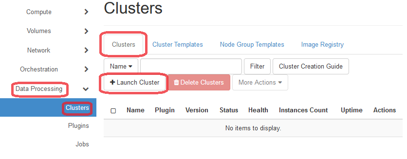
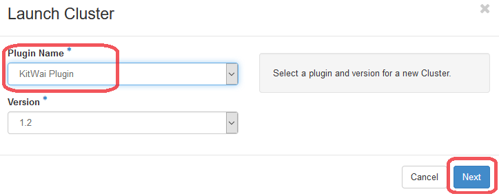
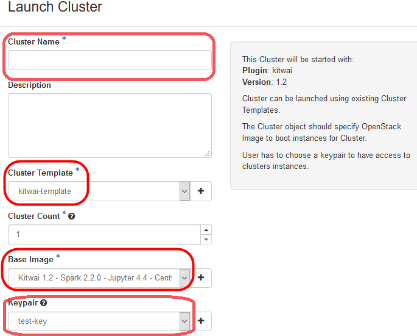
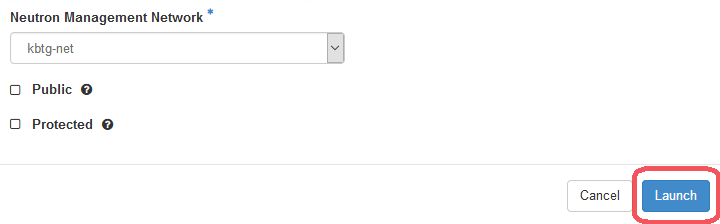
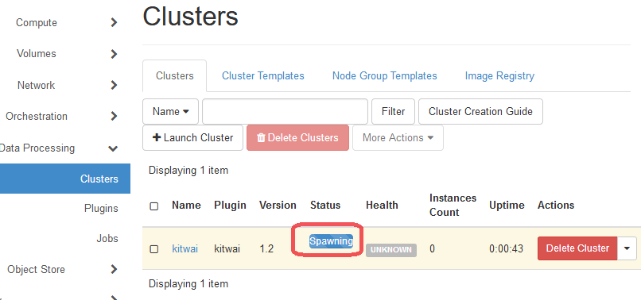
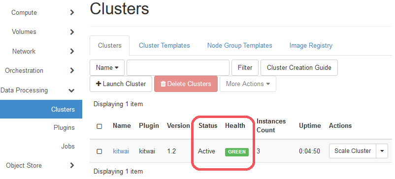

# Launch a Spark Cluster

For launching a spark cluster for running Big Data Analytics jobs on KitWai platforms, please follow the instructions below on how to launch a spark cluster.

1. Click on Data Processing menu and Clusters menu which is under Data Processing menu, respectively. Then, click on Clusters tab and click on Launch Cluster button.

   

   ​

2. On Launch Cluster page, select plugin name as Kitwai Plugin. Then, click on Next button.

   

   ​

3. On Launch Cluster page, enter cluster name as your desired and select your key pair name which is imported in step of importing an user key pair. Ensure that the Cluster Template is set to kitwai-template. and Base Image is set to "KitWai 1.2 - spark 2.2.0 ..." Then, click on Launch button.

   

   

4. While a spark cluster is launching, please wait until cluster status has changed to Active and also health status has changed to Green bar (3-5 minutes).

   

   

   ​
5. Congratulation, the spark cluster is ready in use.

   Each cluster from the kitwai-template consists of 1 master node and 2 worker nodes. The master node runs spark master, namenode and Jupyter processes. The worker nodes run spark worker and datanode processes.

   ​
