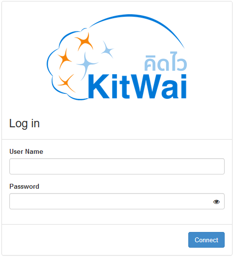
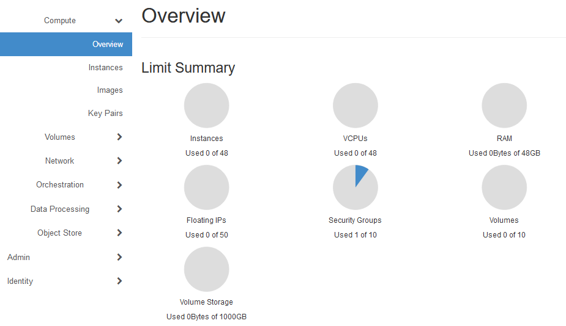
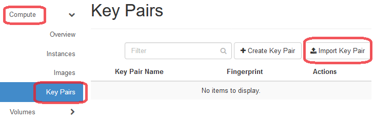
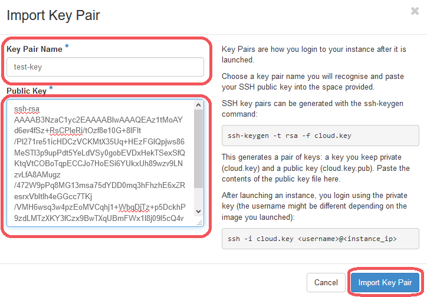
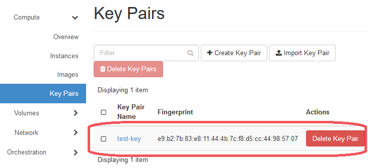

# Login to KitWai and Import Key Pair 

Before launching a spark cluster for running Big Data Analytics jobs, users have to log in to KitWai for importing  a user key pair. A  user key pair will be used for accessing spark cluster instead user password from any SSH clients. For importing a user key pair you can do as instructions below.

1. Connect web browser to [KitWai](https://kitwai.com). 

   

   ​

2. Enter username and password, then click on Connect button.

3. After logging in has succeeded, you will see project overview page. The page shows quota of resources usage such as number of instance, vCPUs  and memory. You will see number of resources usage that is running and also maximum resources usage that you can used on this page.

   

   ​

4. Import a user key pair by clicking on Computer menu and Key Pairs menu which is under Compute menu, respectively. Then, click on Import Key Pair button.

   

   ​

5. On the import key pair page, enter your key pair name and paste your public key content on public key text box and then click on Import Key Pair button.

   

   ​

6. A new key pair will be shown on key pair page after importing a key pair in step 5 has succeeded.

   

   ​

