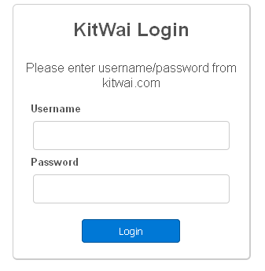
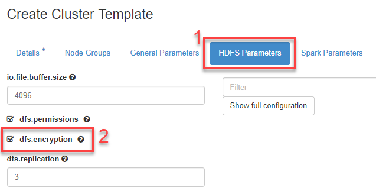

# Security in KitWai

Under construction.

## Authentication and Authorization
We deploy [nginx](https://www.nginx.com/) to provide proxy access to the backend services such that they are not directly exposed to the Internet. These services are further protected by [nginx-keystone-auth](https://github.com/ekasitk/nginx-keystone-auth) which requires users to authenticate with Openstack keystone under which project the cluster or service was launched. Authorization is granted to any user in the same project.



The following services are supported.
- HDFS web UI
- Spark web  and history UI
- Jupyter Notebook
- Zeppelin Notebook

## Data Encryption

The KitWai platform provides Hadoop key provider for data encryption on HDFS. We can enable the data encryption function on the KitWai platform as following steps.

1. While cluster template creation step, click on HDFS tab menu then click on dfs.encryption option for enabling data encryption on HDFS.

   

2. After launching the cluster has been successful then login to name node  by using the IP address of the node via SSH terminal.
```shell
$ ssh centos@IP_OF_NAMENODE
```
3. On the name node, create a new encryption key as following command. For example, the key name is "mykey".
```shell
$ hadoop create key mykey
mykey has been successfully created with options Options{cipher='AES/CTR/NoPadding', bitLength=128, description='null', attributes=null}.
KMSClientProvider[https://kms-cluster-kms-master-0.novalocal:16000/kms/v1/] has been updated.
```
4. Create a  new empty directory on HDFS and make it an encryption zone. For this example, the new empty directory is named secure.
```shell
$ hdfs dfs -mkdir /user/centos/secure
$ hdfs crypto -createZone -keyName mykey -path /user/centos/secure
Added encryption zone /user/centos/secure
```
5. Check list of the encryption zone that is created in the previous step. The output have to show encryption zone directory and encrytion key name.
```shell
$ hdfs dfs -listZones
/user/centos/secure  mykey
```
6. Put a test file into the encryption zone directory. This example, we use "/etc/hosts" file as the test file.
```shell
$ hdfs dfs -put /etc/hosts /user/centos/secure
```


