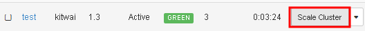
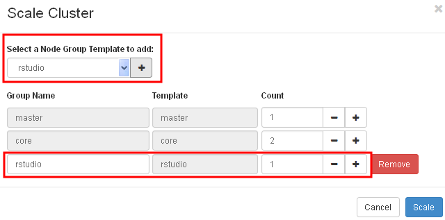
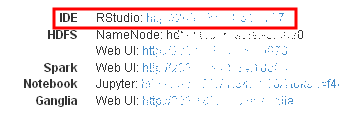
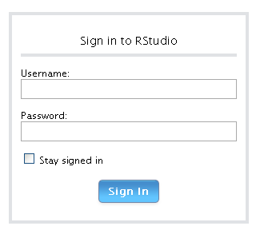
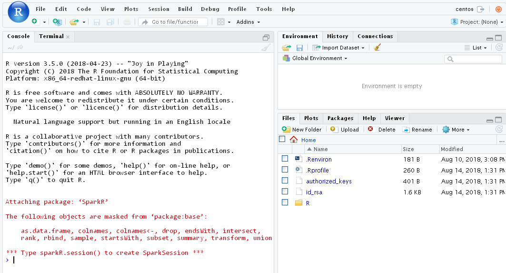
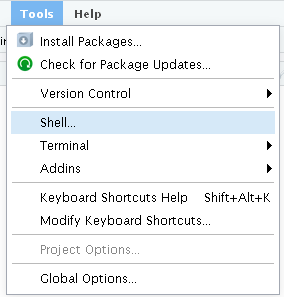
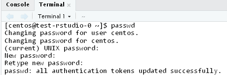
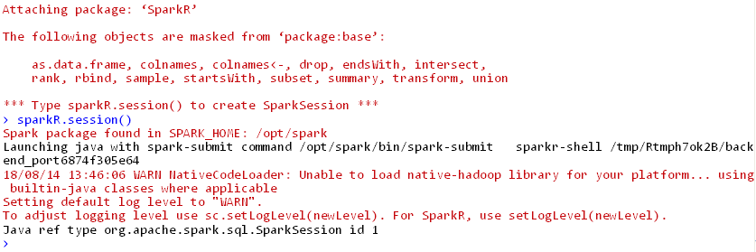

# Using RStudio Server with SparkR

This section shows how to use RStudio Server with SparkR on Spark cluster.

## Start a RStudio server node
First, launch a spark cluster as described previously [here](../launchcluster/launchcluster.md). Then, click on the "Scale Cluster" button.



Add a rstudio node group and click Scale.



After the cluster has finished scaling, click on the RStudio URL to bring up the RStudio Web UI.



## Sign in and change the default password
Sign in with the default username and password as centos to enter the RStudio IDE.





After logged in, change the password by clicking on Tools menu and select Shell.



In the terminal tab, type passwd to change the password.



## Create a Spark session

Back to the R console tab, type

```R
sparkR.session()
```

to create a Spark session.




## Create a DataFrame and query it using SQL
We try creating a DataFrame from R's faithful dataset and display the first lines of the dataset using SparkR::head().
I
```R
df <- as.DataFrame(faithful)
SparkR::head(df)
```
We are expected to see the following result.
```shell
  eruptions waiting                
1     3.600      79
2     1.800      54
3     3.333      74
4     2.283      62
5     4.533      85
6     2.883      55
```

We can read a CSV file into DataFrame and use SQL commands to query it. Let's download a sample bank dataset from [UCI bank dataset](https://archive.ics.uci.edu/ml/datasets/bank+marketing). In the terminal tab, type the following shell commands.

```shell
[centos@test-rstudio-0 ~]$ wget http://archive.ics.uci.edu/ml/machine-learning-databases/00222/bank.zip
[centos@test-rstudio-0 ~]$ unzip bank.zip
[centos@test-rstudio-0 ~]$ hdfs dfs -put bank-full.csv /user/centos
```

In R console, read bank-full.csv file into bank DataFrame.

```R
bankDF <- read.df("bank-full.csv", source = "csv", header = TRUE, delimiter = ";")
```

Create a temporary table in SparkSQL and execute an SQL command.

```R
createOrReplaceTempView(bankDF, "bank")
resultDF <- sql("SELECT age, count(1) FROM bank GROUP BY  age ORDER BY age")
showDF(results)
+---+--------+        
|age|count(1)|
+---+--------+
| 18|      12|
| 19|      35|
| 20|      50|
| 21|      79|
| 22|     129|
| 23|     202|
| 24|     302|
| 25|     527|
| 26|     805|
| 27|     909|
| 28|    1038|
| 29|    1185|
| 30|    1757|
| 31|    1996|
| 32|    2085|
| 33|    1972|
| 34|    1930|
| 35|    1894|
| 36|    1806|
| 37|    1696|
+---+--------+
only showing top 20 rows

```

Currently, SparkR is not the mainstream development of Spark APIs compared to Scala, Java and Python. For other operations of SparkR, please see the [official documentation](https://spark.apache.org/docs/latest/sparkr.html).

## Install additional R libraries
For operations that require additional R packages to process DataFrame on Spark worker nodes, the packages must exist on all worker nodes. So, users are required to manually install the additional packages by the standard installation procedure of R packages on each node.  
