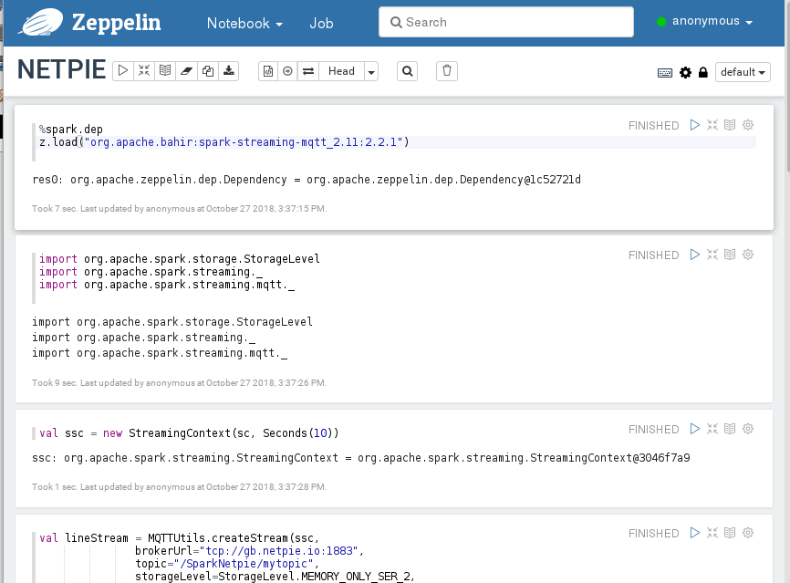

# Connect Spark Streaming to NETPIE IoT Cloud Platform

We show how to connect Spark Streaming to [NETPIE](https://netpie.io/) cloud platform for Internet of Things.

## Find MQTT connection parameters from NETPIE
First, users are required to have a valid the APPID, APPKEY and APPSECRET from a NETPIE account.


Next, we create a new microgear "thing" and obtain its MQTT connection parameters. We'll use these parameters in Spark Streaming.

On any machine, install [microgear-python](https://github.com/netpieio/microgear-python) client library.

```shell
pip install microgear
```

After that, run the following python program. Replace the APPID, APPKEY and APPSECRET obtained from your NETPIE account. Note that if there exists a  microgear-APPKEY.cache file in the current directory, the program will just use the data from the existing microgear thing. Use the output of the program for MQTT plugin parameters in the next steps.

```python
import microgear.client as mc
import time

appid = 'APPID'
appkey = 'APPKEY'
appsecret = 'APPSECRET'

mc.create(appkey,appsecret,appid,{'debugmode': True})
microgear = mc.microgear
times = 1
while not microgear.accesstoken:
    mc.get_token()
    time.sleep(times)
    times = times+10

mqtt_broker = microgear.accesstoken["endpoint"].split("//")[1].split(":")
mqtt_clientid = microgear.accesstoken["token"]
mqtt_username = microgear.gearkey+"%"+str(int(time.time()))
mqtt_password = mc.hmac(microgear.accesstoken["secret"]+"&"+microgear.gearsecret,microgear.accesstoken["token"]+"%"+mqtt_username)

print ("Host: " + mqtt_broker[0])
print ("Port: " + mqtt_broker[1])
print ("ClientId: " + mqtt_clientid)
print ("Username: " + mqtt_username)
print ("Password: " + mqtt_password)
```

## Publish events to NETPIE
Publish events in JSON format. Consult [NETPIE documentation](https://netpie.io/) for  examples and APIs to publish events. In our example program, each event reports load average, CPU utilization and memory usage of a host at every 10 seconds.

```json
{"ts": "2018-10-29T09:53:36+0700", "id": "host-0000", "loadavg": 1.2243, "cpu": 75.7954, "mem": 69.7092}

```

## Start a Zeppelin node
Follow [instructions](../zeppelin/zeppelin.md) to bring up the Zeppelin web-based notebook. Create a new notebook.


## Subscribe messages to Spark Streaming
Create a Spark Streaming application in the Zeppelin notebook as shown in the following steps.

### 1. Go to the first paragraph. Enter the following commands to prepare MQTT dependency package for Spark Streaming.

```scala
%spark.dep
z.load("org.apache.bahir:spark-streaming-mqtt_2.11:2.2.1")
```

Note that these commands must be executed before Spark interpreter starts if you see an error message *"Must be used before SparkInterpreter (%spark) initialized"*. In such case, you must restart Spark interpreter in order for these commands to take effect. If needed, click on the dropdown list at the upper right conner and select interpreter. Find the spark interpreter and click restart.



### 2. In the next paragraph, import libraries and create Spark Streaming context with batch interval set to 10 seconds.

```scala
import org.apache.spark.storage.StorageLevel
import org.apache.spark.streaming._
import org.apache.spark.streaming.mqtt._

val ssc = new StreamingContext(sc, Seconds(10))
```

### 3. Then, create data stream from using the previous MQTT connection parameters in the next paragraph.

The lineStream is a stream of events, each of which is of the string data type.

```scala
val lineStream = MQTTUtils.createStream(ssc,
                 brokerUrl="tcp://HOST:PORT",
                 topic="/APPID/MYTOPIC",
                 storageLevel=StorageLevel.MEMORY_ONLY_SER_2,
                 clientId=Some(CLIENTID),
                 username=Some(USERNAME),
                 password=Some(PASSWORD),
                 cleanSession=None,
                 qos=None,
                 connectionTimeout=None,
                 keepAliveInterval=None,
                 mqttVersion=None)
```

### 4. In the next paragraph, create window stream.

We create a sliding window of event at every 10 seconds. The window size is set to 60 seconds.

```scala
val lineStream60 = lineStream.window(Seconds(60), Seconds(10))
```

### 5. Create a new paragraph with the following command to show some messages received from NETPIE.

```scala
lineStream60.print
```

### 6. In the last paragraph, start Spark Streaming with the following command.
```scala
ssc.start
ssc.awaitTermination
```

The last 60 second events received from NETPIE will be displayed on the output of this paragraph every 10 seconds.


## Calculate moving average
To compute moving average for each sliding window. Replace the paragraph **lineStream60.print** with the following code. Restart interpreter and rerun the notebook.

According to Spark Streaming, the lineStream60 is the continuous stream of events organized into sequence of RDDs. Each RDD consists of events within a particular window. We convert each RDD into DataFrame and register it as a table *measure*. Then, we can use SQL commands to operate the streaming data. The result avgDF is a DataFrame which only the first 20 rows are shown.

```scala
lineStream60.foreachRDD( rdd => {
    val ds = spark.createDataset(rdd)
    val measureDF = spark.read.schema("ts Timestamp, id String, loadavg double, cpu double, mem double").option("timestampFormat", "yyyy-MM-dd'T'HH:mm:ssZ").json(rdd)
    measureDF.createOrReplaceTempView("measure")
    val avgDF = spark.sql("select max(ts) as ts, id, avg(loadavg), avg(cpu), avg(mem) from measure group by id order by ts, id")
    avgDF.show
})
```


## Write output to files
Since the length of output display is limited by Zeppelin, for long running jobs like Spark Streaming, the output will be truncated after some time. Moreover, the output of Spark Streaming is usually used by other systems such as displaying in a dashboard, storing in a database, or sending to other event streams (even NETPIE). So, we show how to save the output of Spark Streaming into separate files.

We replace avgDF.show with
```scala
    avgDF.repartition(1).write.csv("/tmp/avg-" + System.currentTimeMillis)
```
The data of avgDF DataFrame at a specific window time are combined into one partition and written into HDFS. The output is available in file part-00000-\*.csv under the folder /tmp/avg-<timestamp>.

Thus, the paragraph **lineStream60.print** becomes.

```scala
lineStream60.foreachRDD( rdd => {
    val ds = spark.createDataset(rdd)
    val measureDF = spark.read.schema("ts Timestamp, id String, loadavg double, cpu double, mem double").option("timestampFormat", "yyyy-MM-dd'T'HH:mm:ssZ").json(rdd)
    measureDF.createOrReplaceTempView("measure")
    val avgDF = spark.sql("select max(ts) as ts, id, avg(loadavg), avg(cpu), avg(mem) from measure group by id order by ts, id")
    avgDF.repartition(1).write.csv("/tmp/avg-" + System.currentTimeMillis)
})

```
Restart interpreter and rerun the notebook.
