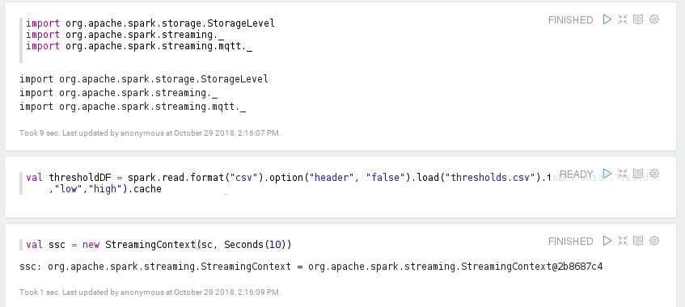

# Simple Threshold-based Anomaly Detection

This section provides an example for simple threshold-based anomaly detection based on Spark Streaming and SparkSQL.
The example is capable to handle several thousands events per second with mini-batch processing on a small cluster when configured properly.

Before continue, follow the [previous instructions](netpie.md) to create a simple Spark Streaming application that receives events from NETPIE.

## Prepare the threshold configuration file
Create the thresholds.csv file where each record defines the lower and upper thresholds for each attribute of a host. Put only attributes that are needed checking.

```
host-0000,loadavg,0.0,3.0
host-0000,cpu,0.0,90.0
host-0000,mem,0.0,85.0
host-0001,loadavg,0.0,3.0
host-0001,cpu,0.0,80.0
host-0001,mem,0.0,70.0

```

Then, using shell command to copy thresholds.csv into HDFS.
```sh
hdfs dfs -put thresholds.csv /user/centos/thresholds.csv
```

## Read thresholds.csv into table under SparkSQL
In Zeppelin, insert the following paragraph before creating the StreamingContext. The thresholds are loaded into table *threshold*. Notice that we cache the table in memory so that the file is not reloaded from HDFS every time.

```scala
val thresholdDF = spark.read.format("csv").option("header", "false").load("thresholds.csv").toDF("id","field","low","high").cache
thresholdDF.createOrReplaceTempView("threshold")
```
The paragraph looks like the following figure.



## Find latest events that exceed (above or below) threshold in the current window
We find events which are the latest ones (maximum timestamp) and violate thresholds by the following paragraph and it is described below.

```scala
lineStream60.foreachRDD( rdd  =>  {
  val ds = spark.createDataset(rdd)
  val measureDF = spark.read.schema("ts Timestamp, id String, loadavg double, cpu double, mem double").option("timestampFormat", "yyyy-MM-dd'T'HH:mm:ssZ").json(rdd)
  measureDF.createOrReplaceTempView("measure")

   val unpivotDF = spark.sql("""
select ts, id, stack(3, 'loadavg', loadavg, 'cpu', cpu, 'mem', mem) as (field,value)
from measure
order by ts asc, id asc, field asc
""")
   unpivotDF.createOrReplaceTempView("event")

   val lastViolateDF = spark.sql("""
select *
from (
   select row_number() over (partition by event.id, event.field order by ts desc) as row_no, ts, event.id, event.field, value, low, high
   from event, threshold
   where event.id = threshold.id and
         event.field = threshold.field and
         (value < low or value > high)
) as temp
where row_no = 1
""")
   lastViolateDF.show()


})
```

The measure table is converted from wide into long table, named *event*. For each record in measure table, the three columns will be unpivoted into 3 records in event table. The event table looks like figure below.

```
+-------------------+---------+-------+-------+
|                 ts|       id|  field| value|
+-------------------+---------+-------+-------+
|2018-10-29 16:03:42|host-0002|    cpu| 97.616|
|2018-10-29 16:03:42|host-0002|loadavg| 0.1783|
|2018-10-29 16:03:42|host-0002|    mem|55.7197|
|2018-10-29 16:03:43|host-0002|    cpu|98.0138|
|2018-10-29 16:03:43|host-0002|loadavg| 0.2029|
|2018-10-29 16:03:43|host-0002|    mem|55.5959|
|2018-10-29 16:03:44|host-0002|    cpu|98.0768|
|2018-10-29 16:03:44|host-0002|loadavg| 0.1439|
|2018-10-29 16:03:44|host-0002|    mem|55.3159|

```

Once the event table has been built, it is joined with the threshold table on host id and field. Then, we use nested query to filter interesting events. First, the joined result is filtered for events that fall beyond low-high range. Then, it is augmented with additional *row_no* column which is defined as the row number over the partition of host id and field sorted by timestamp in descending order. This augmented table is aliased as *temp* and looks similar to the figure below. The outer query finds only the records that has the maximum timestamp (row_no=1) over each partition.

```
+------+-------------------+---------+-------+-------+---+----+
|row_no|                 ts|       id|  field|  value|low|high|
+------+-------------------+---------+-------+-------+---+----+
|     1|2018-10-29 17:08:59|host-0001|loadavg| 3.0675|0.0| 3.0|
|     2|2018-10-29 17:08:57|host-0001|loadavg| 3.1835|0.0| 3.0|
|     3|2018-10-29 17:08:56|host-0001|loadavg| 3.1625|0.0| 3.0|
|     4|2018-10-29 17:08:55|host-0001|loadavg| 3.1767|0.0| 3.0|
|     1|2018-10-29 17:08:59|host-0001|    mem|90.0614|0.0|70.0|
|     2|2018-10-29 17:08:58|host-0001|    mem|90.0588|0.0|70.0|
|     3|2018-10-29 17:08:57|host-0001|    mem|89.7509|0.0|70.0|
|     4|2018-10-29 17:08:56|host-0001|    mem|89.4845|0.0|70.0|
|     5|2018-10-29 17:08:55|host-0001|    mem|89.4921|0.0|70.0|
|     1|2018-10-29 17:08:59|host-0002|    cpu|98.2341|0.0|80.0|   
|     2|2018-10-29 17:08:58|host-0002|    cpu|97.9488|0.0|80.0|
|     3|2018-10-29 17:08:57|host-0002|    cpu|98.2938|0.0|80.0|
|     4|2018-10-29 17:08:56|host-0002|    cpu|98.3882|0.0|80.0|
|     5|2018-10-29 17:08:55|host-0002|    cpu|98.2443|0.0|80.0|
|     6|2018-10-29 17:08:54|host-0002|    cpu|98.0768|0.0|80.0|
```

## Find latest events that exceed thresholds for at least 3 times in the current window (show only last violated event)

In this case, use the following query instead. The table is augmented with cnt column which is defined as the number of row in the partition. The cnt column is used to filter 3 violations in the current window.

```scala
   val threeViolateDF = spark.sql("""
select *
from (
   select row_number() over (partition by event.id, event.field order by ts desc) as row_no, count(value) over (partition by event.id, event.field) as cnt, ts, event.id, event.field, value, low, high
   from event, threshold
   where event.id = threshold.id and
      event.field = threshold.field and
      (value < low or value > high)
) as temp
where row_no = 1 and cnt > 3
""")
   threeViolateDF.show()
```

## Find latest events that exceed thresholds for at least 3 consecutive times in a single window

For this criteria, the joined table is augmented with 2 columns, value1 and value2, referring the two values from the previously consecutive timestamps. So, if each row consists of value in the current, the previous one, and the previous two events. Then, filter only the latest 3 events that violate thresholds.

```scala
val lastThreeConsecutiveDF = spark.sql("""
select *
from (
   select row_number() over (partition by event.id, event.field order by ts desc) as row_no, ts, event.id, event.field, value, lead(value,1) over (partition by event.id, event.field order by ts desc) as value1 , lead(value,2) over (partition by event.id, event.field order by ts desc) as value2, low, high
   from event, threshold
   where event.id = threshold.id and
      event.field = threshold.field
) as temp
where (value < low or value > high) and
      (value1 < low or value1 > high) and
      (value2 < low or value2 > high) and
      (row_no = 1)
""")
lastThreeConsecutiveDF.show()
```

## Detect disconnected hosts
To detect hosts that are completely shutdown or unreachable, we keep connection status of each host using updateStateByKey transformation. The State class is defined to store the last known status. The lastUpdated field is refreshed when a new event arrives. We create the updateDeviceStatus function that takes the current State and a list of events from stream, and updates the State object of a particular host accordingly. If the event has been lost for 60 seconds, the status is changed to DISCONNECTED. If the event has been lost for too long time (1 day), we assume that the host is gone permanently and then revoke the State object of the host.

Each event in input stream is transformed to a pair of (host,row) in which each row represents the event. Then the pairs are group by key and passed to the updateDeviceStatus function. The hosts with DISCONNECTED status are filtered and displayed. Checkpointing is required for the updateStateByKey transformation, so we set the HDFS folder to store checkpoint data (The folder must already be existed). Insert the paragraph below before starting StreamingContext and restart the notebook.

```scala
import java.sql.Timestamp
import org.apache.spark.sql.Row

case class State(var status: String, var lastUpdated: java.sql.Timestamp)

val updateDeviceStatus: (Seq[Row], Option[State]) => Option[State] = (measures, oldState) => {
  var state = oldState.getOrElse(State("DISCONNECTED", new Timestamp(0)))
  measures.foreach( measure => {
    val datetime = measure.getAs[Timestamp]("ts")
    if (state.lastUpdated.before(datetime)) {
      state.status = "CONNECTED"
      state.lastUpdated = datetime
    }
  })
  val t = new Timestamp(System.currentTimeMillis)
  val diff = t.getTime - state.lastUpdated.getTime
  if (diff > 24*3600*1000)  // Assume device withdrawn permanently
    None
  else if (diff > 60*1000) {
    state.status = "DISCONNECTED"
    Some(state)
  } else
    Some(state)
}

lineStream.transform( rdd => {
  val measureDF = spark.read.schema("ts Timestamp, id String, loadavg double, cpu double, mem double").option("timestampFormat", "yyyy-MM-dd'T'HH:mm:ssZ").json(rdd)
  measureDF.rdd.map(measure => (measure.getAs[String]("id"), measure))
}).updateStateByKey(updateDeviceStatus).filter{ case (uuid,s) => s.status == "DISCONNECTED" }.print

ssc.checkpoint("/checkpoint")
```

## How to update threshold settings
For long running applications, it is necessary to update threshold settings without having to stop the Spark Streaming job. There are options to achieve this. One option is to reload the whole thresholds.csv file into threshold table at a  regular interval in the lineStream60.foreachRDD transformation. Another option would be to send only the new thresholds in a separate stream and merge them into the existing threshold table (joining stream and DataFrame).
