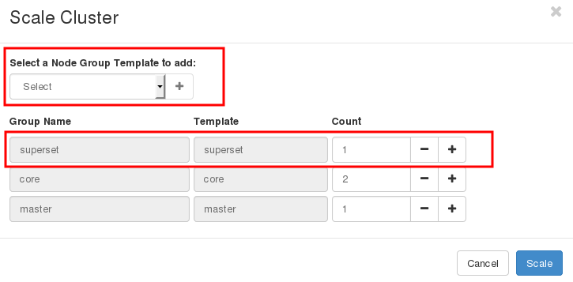
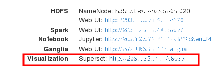

# SparkSQL and JDBC Connection

SQL command is one of the most widely-used languages to query data from databases. SparkSQL allows user to use SQL commands to process data in Spark as if the data were stored in a database. SparkSQL will transform any SQL commands into Spark's RDD operations. With Spark's Thrift server, any JDBC compatible clients can submit SQL queries to SparkSQL.  

In this section, we create a Spark cluster with Thrift server. Then, show how to use a JDBC client, beeline, to manipulate and query data.

## Launch a Spark cluster with Thrift server
Follow this [guide](../../launchcluster/launchcluster.md) to launch a Spark cluster.

Then, click on Scale to add a superset node which has Thrift installed.   



This node also has Apache Superset, a data visualization tool which can connect to Thrift server via JDBC connection. If interested, see [an example of Thailand Government Spending](thailand_gov_spending/spending.md) for a guideline to use SparkSQL with Superset.

Note the IP of the superset node which we will use it to login to the node in the next step.




## Login to the node and download sample data

Login to the superset node by using the IP address of the node.
```shell
$ ssh centos@IP_OF_SUPERSET
[centos@test-superset-0 ~]$
```

Run the following commands to download sample data. The sample data is from [UCI bank dataset](https://archive.ics.uci.edu/ml/datasets/bank+marketing).

```shell
[centos@test-superset-0 ~]$ wget http://archive.ics.uci.edu/ml/machine-learning-databases/00222/bank.zip
[centos@test-superset-0 ~]$ unzip bank.zip
[centos@test-superset-0 ~]$ hdfs dfs -put bank-full.csv /user/centos
```

The sample data looks like:
```
"age";"job";"marital";"education";"default";"balance";"housing";"loan";"contact";"day";"month";"duration";"campaign";"pdays";"previous";"poutcome";"y"
58;"management";"married";"tertiary";"no";2143;"yes";"no";"unknown";5;"may";261;1;-1;0;"unknown";"no"
44;"technician";"single";"secondary";"no";29;"yes";"no";"unknown";5;"may";151;1;-1;0;"unknown";"no"
```

## Submit queries with beeline

Connect beeline to Thrift server. Suppose that the superset node is named test-superset-0. we set the connection string to jdbc:hive2://test-superset-0:1000. We can also use localhost here. Set the username to centos. The password is ignored by default.

```
[centos@test-superset-0 ~]$ beeline
Beeline version 1.2.1.spark2 by Apache Hive
beeline> !connect jdbc:hive2://test-superset-0:10000
Connecting to jdbc:hive2://test-superset-0:10000
Enter username for jdbc:hive2://test-superset-0:10000: centos
Enter password for jdbc:hive2://test-superset-0:10000:
18/08/01 16:48:08 INFO Utils: Supplied authorities: test-superset-0:10000
18/08/01 16:48:08 INFO Utils: Resolved authority: test-superset-0:10000
18/08/01 16:48:08 INFO HiveConnection: Will try to open client transport with JDBC Uri: jdbc:hive2://test-superset-0:10000
Connected to: Spark SQL (version 2.3.1)
Driver: Hive JDBC (version 1.2.1.spark2)
Transaction isolation: TRANSACTION_REPEATABLE_READ
0: jdbc:hive2://test-superset-0:10000>
```

Then, type the following SQL commands in beeline.

```sql
CREATE DATABASE bank;

USE bank;

CREATE TABLE bank
USING csv
OPTIONS (header 'true', inferSchema 'true', delimiter '\073', mode 'FAILFAST')
LOCATION '/user/centos/bank-full.csv';

SELECT age, count(1) FROM bank GROUP BY  age ORDER BY age;

+------+-----------+--+
| age  | count(1)  |
+------+-----------+--+
| 18   | 12        |
| 19   | 35        |
| 20   | 50        |
| 21   | 79        |

...  skip ...

```

Note that beeline cannot parse ; (semicolon) in SQL command correctly. So we replace it with ascii code \073.

Type Ctrl-D to exit from beeline.
