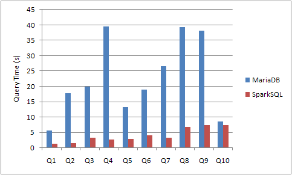

# Benchmark with MariaDB 10.3
This section compares the performance between using SparkSQL versus MariaDB (a MySQL fork) for processing Thailand Government Spending queries.

## Hardware and Software Setup
- MariaDB
Version 10.3 with InnoDB storage engine.
1 node, 4 cores, 8 GB RAM , 20 GB Harddisk

- SparkSQL
Spark 2.3.1 With all tables cached in memory.
2 Worker nodes, each has 2 cores, 4 GB RAM, 20 GB Hardisk
1 Thrift server node, 4 cores, 8 GB RAM, 20 GB Harddisk


## Result
Without specific optimization, all queries in SparkSQL finish faster than plain MariaDB.



All queries are listed below. Note that for MariaDB, we create indices on contract.subdep_name and department.subdep_name; otherwise the queries that join contract and deparment tables never finish in 30 min.

```sql
Q1) select count(distinct(proj_no)) as count from contract;

Q2) select sum(max)/1E6 as total_budget from (select max(proj_mny) as max from contract group by proj_no) tbl;


Q3) select last_day(contrct_date) as month, sum(budget)/1E6 as total_budget, sum(price)/1E6 as total_price
from (select proj_no, contrct_date, max(proj_mny) as budget, sum(contrct_price) as price
      from contract group by proj_no, contrct_date
) tbl
group by last_day(contrct_date)
order by month

Q4) select typ_name, count(*) as count
from (select proj_no, typ_name from contract group by proj_no, typ_name) tbl
group by typ_name;

Q5) select proj_name, sum(contrct_price)/1E6 price from contract group by proj_name order by price desc limit 10;

Q6) select provnc, sum(contrct_price)/1E6 as price
from contract, department
where contract.subdep_name = department.subdep_name
group by provnc
order by price desc
limit 10;

Q7) select org_name, sum(contrct_price)/1E6 as price
from contract, department
where contract.subdep_name = department.subdep_name
group by org_name
order by price desc
limit 10;

Q8) select dep_name, typ_name, sum(contrct_price)/1E6 as price
from contract, department
where contract.subdep_name = department.subdep_name
and department.dep_name in (select * from
   (select dep_name
   from contract, department
   where contract.subdep_name = department.subdep_name
   group by dep_name
   order by sum(contrct_price) desc
   limit 10) tbl)
)
group by dep_name, typ_name;

Q9) select dep_name, mthd_name, sum(contrct_price)/1E6 as price
from contract, department
where contract.subdep_name = department.subdep_name
and department.dep_name in (select * from
   (select dep_name
   from contract, department
   where contract.subdep_name = department.subdep_name
   group by dep_name
   order by sum(contrct_price) desc
   limit 10) tbl)
)
group by dep_name, mthd_name;

Q10) SELECT provnc, sum(contrct_price)/1E6 as price
FROM contract, (select dep_no, subdep_name,provnc FROM department GROUP BY dep_no, subdep_name,provnc) dep
WHERE contract.subdep_name = dep.subdep_name
GROUP BY provnc;


```
