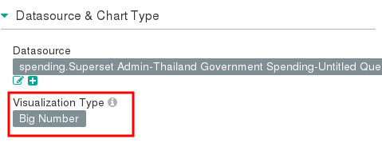
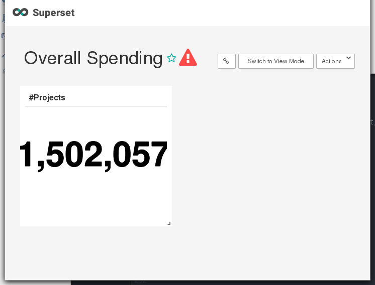

# Thailand Government Spending
In this example, we show steps how to query and visualize Thailand government spending dataset using SparkSQL and Superset.

*It should be noted that this example is for demonstration only since we didn't do data cleansing. For more accurate and complete information check the official [web site](https://govspending.data.go.th/).*

## Download sample database
The dataset can be downloaded from [Open Government Data](https://data.go.th/Default.aspx). The dataset is semimonthly published Comptroller General's Department in CSV format. Users can download the CSV files by using web browser. The dataset is divided into many files, each of which has the following structure.

```
contract.csv:
proj_no,proj_name,subdep_name,annce_date,proj_mny,cost_build,mthd_name,typ_name,win_tin,corp_name,contrct_price,contrct_num,contrct_date,contrct_fhdate

project_location.csv:
proj_no,poi_type,item_num,lat,long

budget_id.csv:
proj_no,seq_num,budgt_yr,bud_no,src_budgt_no,budgt_mny

corporate.csv:
merchnt_tin,merchnt_name,merchnt_add,merchnt_soi,merchnt_road,merchnt_moo_num,moi_addr,moi1_addr,moi2_addr,merchnt_postcode,merchnt_lat,merchnt_long

department.csv:
org_name,dep_no,dep_name,subdep_num,subdep_name,subdep_addr,moi_addr,provnc

project_status.csv:
proj_no,contrct_num

```

For our example, we use the data during 2017/10 - 2018/01 (the first four months of 2018 fiscal year).
From observation, many long ID fields such as contract.win_tin, corporate.merchnt_tin, and department.subdep_num are distorted from the source (e.g. 0225532000016 becomes 2.25532E+11). These causes problems in queries that relate records between tables.

In contract.csv, proj_mny and cost_build are the budget and appraisal cost of the project, respectively. The link to department is done by subdep_name which is not exactly right since subdep_name is not unique ID. The format of contrct_date in some records are in dd/MM/YYYY; while others in YYYY-MM-dd. Moreover, there can be multiple (sub) contracts for each project NO. The summation of contrct_price of all sub contracts should be equal to the project price. However, we found that some users input the whole contract price together with all its sub-contract prices in separated records so the summation of contrct_price will be doubled such as in proj_no 58035126663. We also found records having duplicated contrct_num although they are in different proj_no.

For department.csv. the same department records can appear in several files of months/years and they are involved in different projects in different time.
Similarly, corporate records appear several times as well.
Records in budget_id are always duplicated according to the number of sub-contracts of a project.  

## Launch a Spark cluster with Superset
Follow this [guide](../../launchcluster/launchcluster.md) to launch a Spark cluster.

Then, click on Scale to add a superset node.


Note the IP of the superset node which we will use it to login.


## Upload data and convert character encoding
Upload the CSV files to the superset node.

Login to the superset node.

For all CSV files, convert the character encoding to UTF-8 as follows.
```shell
mkdir utf8
iconv  -f ISO-8859-11 -t UTF-8 25610101_contract.csv > utf8/25610101_contract.csv
iconv  -f ISO-8859-11 -t UTF-8 25610102_contract.csv > utf8/25610102_contract.csv
iconv  -f ISO-8859-11 -t UTF-8 25610101_project_location.csv > utf8/25610101_project_location.csv
iconv  -f ISO-8859-11 -t UTF-8 25610102_project_location.csv > utf8/25610102_project_location.csv
iconv  -f ISO-8859-11 -t UTF-8 25610102_budget_id.csv > utf8/25610102_budget_id.csv
iconv  -f ISO-8859-11 -t UTF-8 25610102_corporate.csv > utf8/25610102_corporate.csv
iconv  -f ISO-8859-11 -t UTF-8 25610102_department.csv > utf8/25610102_department.csv
iconv  -f ISO-8859-11 -t UTF-8 25610102_project_status.csv > utf8/25610102_project_status.csv

... skip ....

```

## Copy data into HDFS

```shell
hdfs dfs -mkdir /spending
hdfs dfs -put utf8/* /spending

```

## Create database and tables in SparkSQL


Suppose that the superset node is named test-superset-0. We create a database and tables using beeline command line.

```
[centos@test-superset-0 ~]$ beeline
Beeline version 1.2.1.spark2 by Apache Hive
beeline> !connect jdbc:hive2://test-superset-0:10000
Connecting to jdbc:hive2://test-superset-0:10000
Enter username for jdbc:hive2://test-superset-0:10000: centos
Enter password for jdbc:hive2://test-superset-0:10000:
18/08/01 16:48:08 INFO Utils: Supplied authorities: test-superset-0:10000
18/08/01 16:48:08 INFO Utils: Resolved authority: test-superset-0:10000
18/08/01 16:48:08 INFO HiveConnection: Will try to open client transport with JDBC Uri: jdbc:hive2://test-superset-0:10000
Connected to: Spark SQL (version 2.3.1)
Driver: Hive JDBC (version 1.2.1.spark2)
Transaction isolation: TRANSACTION_REPEATABLE_READ
0: jdbc:hive2://test-superset-0:10000>
```

Then, type the following SQL commands in beeline.

```sql
CREATE DATABASE spending;

USE spending;

CREATE TABLE contract (
  proj_no string,
  proj_name string,
  subdep_name string,
  annce_date date,
  proj_mny double,
  cost_build double,
  mthd_name string,
  typ_name string,
  win_tin string,
  corp_name string,
  contrct_price double,
  contrct_num string,
  contrct_date date,
  contrct_fhdate date
) USING csv
OPTIONS (mode 'FAILFAST', header 'true', inferSchema 'false', multiLine 'true', ignoreTrailingWhiteSpace 'true', dateFormat 'd/M/y')
LOCATION '/spending/*_contract.csv';

CREATE TABLE project_location (
  proj_no string,
  poi_type string,
  item_num int,
  lat double,
  long double
) USING csv
OPTIONS (mode 'FAILFAST', header 'true', inferSchema 'false', multiLine 'true', ignoreTrailingWhiteSpace 'true')
LOCATION '/spending/*_project_location.csv';

CREATE TABLE budget_id (
  proj_no string,
  seq_num int,
  budgt_yr int,
  bud_no string,
  src_budgt_no string,
  budgt_mny double
) USING csv
OPTIONS (mode 'FAILFAST', header 'true', inferSchema 'false', multiLine 'true', ignoreTrailingWhiteSpace 'true')
LOCATION '/spending/*_budget_id.csv';

CREATE TABLE corporate (
  merchnt_tin string,
  merchnt_name string,
  merchnt_add string,
  merchnt_soi string,
  merchnt_road string,
  merchnt_moo_num string,
  moi_addr string,
  moi1_addr string,
  moi2_addr string,
  merchnt_postcode string,
  merchnt_lat double,
  merchnt_long double
) USING csv
OPTIONS (mode 'FAILFAST', header 'true', inferSchema 'false', multiLine 'true', ignoreTrailingWhiteSpace 'true')
LOCATION '/spending/*_corporate.csv';

CREATE TABLE department (
  org_name string,
  dep_no string,
  dep_name string,
  subdep_num string,
  subdep_name string,
  subdep_addr string,
  moi_addr string,
  provnc string
) USING csv
OPTIONS (mode 'FAILFAST', header 'true', inferSchema 'false', multiLine 'true', ignoreTrailingWhiteSpace 'true')
LOCATION '/spending/*_department.csv';

CREATE TABLE project_status (
  proj_no string,
  contrct_num string
) USING csv
OPTIONS (mode 'FAILFAST', header 'true', inferSchema 'false', multiLine 'true', ignoreTrailingWhiteSpace 'true')
LOCATION '/spending/*_project_status.csv';
```

Check if the tables have been created.

```
0: jdbc:hive2://test-superset-0:10000> show tables;
+-----------+-------------------+--------------+--+
| database  |     tableName     | isTemporary  |
+-----------+-------------------+--------------+--+
| spending  | budget_id         | false        |
| spending  | contract          | false        |
| spending  | corporate         | false        |
| spending  | department        | false        |
| spending  | project_location  | false        |
| spending  | project_status    | false        |
+-----------+-------------------+--------------+--+
6 rows selected (0.146 seconds)
```

## Cache all tables in memory
To utilize memory for faster query processing, we should cache all tables in memory (provided that the aggregated memory of all spark worker nodes are large enough).

```sql
cache table budget_id;
cache table contract;
cache table corporate;
cache table department;
cache table project_location;
cache table project_status;
```

Then, press Ctrl-D to exit from beeline.

## Configure SparkSQL in Superset

Then, click on the Superset URL in cluster info. This will open the Superset login page. The default username and password is admin.


Users are highly recommended to change the password in the Profile menu right after logged in.


Click on the Database menu to create a new database with the following data. Replace the superset node in SQLAlchemy URI with the correct one.

Database: Thailand Government Spending
SQLAlchemy URI: sparksql://test-superset-0:10000
Expose in SQL Lab: YES
Allow CREATE TABLE AS: YES
Allow DML: YES


Click Test Connection button.


Click Save button at the bottom of the page.


## Query and create charts/dashboards
We'll show how to query the database using SQL command. From the results, we'll create charts and put them in a dashboard.

To execute an SQL command, click on the SQL Editor under SQL Lab menu.


Select Thailand Government Spending database.
Select spending schema.

Type the following SQL query.
```sql
select count(distinct(proj_no)) as count from contract;
```
Click Run Query button.


Click Visualize button.


Change Visualization Type to Big Number.



Change Number Format to ,.2f

Click Save button and select Add to new dashboard. Enter the name of new dashboard, e.g. Overall Spending. Then, click Save & go to dashboard.



Click Actions/Save to save the dashboard change.

Next, we repeat the previous steps to create a chart for the total budget.  
```sql
select sum(max)/1E6 as total_budget
from (
   select max(proj_mny) as max
   from contract group by proj_no
)
```

For budget and price per month, draw a time series line chart. We use last_day() to grouped and sorted projects by months.
```sql
select trunc(last_day(contrct_date),"month") as month, sum(budget)/1E6 as total_budget, sum(price)/1E6 as total_price
from (select proj_no, contrct_date, max(proj_mny) as budget, sum(contrct_price) as price
      from contract group by proj_no, contrct_date
)
group by last_day(contrct_date)
order by month
```

Create two pie charts for the number and price by category, as follows.
```sql
select count(distinct(proj_no)) as count from contract;

select typ_name, sum(contrct_price)/1E6 as price from contract group by typ_name;
```

We can visualize top-10 project price in a table view.
```sql
select proj_name, sum(contrct_price)/1E6 price from contract group by proj_name order by price desc limit 10;
```

Now, the dashboard looks like.


For convenience, the complete dashboard can be imported from file. See [How to import a dashboard](#how-to-import-a-dashboard)

Next, we create another dashboard, called Top Spending, consisting of 5 charts as follows.

Top-10 price by province in bar chart.
```sql
select provnc, sum(contrct_price)/1E6 as price
from contract, department
where contract.subdep_name = department.subdep_name
group by provnc
order by price desc
limit 10;
```

Top-10 price by department in bar chart.
```sql
select dep_name, sum(contrct_price)/1E6 as price
from contract, department
where contract.subdep_name = department.subdep_name
group by dep_name
order by price desc
limit 10
```

Top-10 price by department type in pie chart.
```sql
select org_name, sum(contrct_price)/1E6 as price
from contract, department
where contract.subdep_name = department.subdep_name
group by org_name
order by price desc
limit 10
```

Purchasing type by top-10 department in (stacked) bar chart.
```sql
select dep_name, typ_name, sum(contrct_price)/1E6 as price
from contract, department
where contract.subdep_name = department.subdep_name
and department.dep_name in (
   select dep_name
   from contract, department
   where contract.subdep_name = department.subdep_name
   group by dep_name
   order by sum(contrct_price) desc
   limit 10
)
group by dep_name, typ_name
```

Purchasing method by top-10 department in heatmap.
```sql
select dep_name, mthd_name, sum(contrct_price)/1E6 as price
from contract, department
where contract.subdep_name = department.subdep_name
and department.dep_name in (
   select dep_name
   from contract, department
   where contract.subdep_name = department.subdep_name
   group by dep_name
   order by sum(contrct_price) desc
   limit 10
)
group by dep_name, mthd_name
```

The Top Spending dashboard is shown below.


## Working with maps
We need to create an additional table and a view. The thailand_province provides the lat/long of all provinces in Thailand as well as the province code in ISO 3166-2. We'll directly load it from Swift storage.

We create a view province_price for using with maps to avoid the data type problems in the current version of Superset.

```sql
CREATE TABLE thailand_province (
  id_0 int,
  iso string,
  name_0 string,
  id_1 int,
  name_1 string,
  type_1 string,
  engtype_1 string,
  nl_name_1 string,
  varname_1 string,
  lat double,
  lon double
) using csv
OPTIONS (mode 'FAILFAST', header 'true', inferSchema 'false', multiLine 'true', ignoreTrailingWhiteSpace 'true')
LOCATION 'swift://public.sahara/thailand_province.csv';

cache table thailand_province;

CREATE VIEW province_price AS
SELECT iso, provnc, lat, lon, price
FROM thailand_province
LEFT JOIN (
   SELECT provnc, sum(contrct_price)/1E6 as price
   FROM contract, (select dep_no, subdep_name,provnc FROM department GROUP BY dep_no, subdep_name,provnc) dep
   WHERE contract.subdep_name = dep.subdep_name
   GROUP BY provnc
) p
ON thailand_province.nl_name_1 = p.provnc;

```

Then in SQL Editor, query
```
select * from province_price
```

For the country map visualization, select iso field as ISO 3166-2 code, AGG SUM price as metric, and Thailand as Country Name.


For deck.gl scatter plot, select lon/lat, Map Style, View port, and Point Size as shown below. Note that this chart requires MAPBOX API KEY.


The Spending Map dashboard is shown below.


## How to import a dashboard
Users may optionally import the previous dashboards into Superset if the database name is matching, i.e. Thailand Government Spending.

Download the dashboards.
- [Spending Overall](dashboard_overall_spending.json)
- [Top Spending](dashboard_top_spending.json)
- [Spending Map](dashboard_spending_map.json)

Click on Import dashboards under Manage menu and select the downloaded file.
