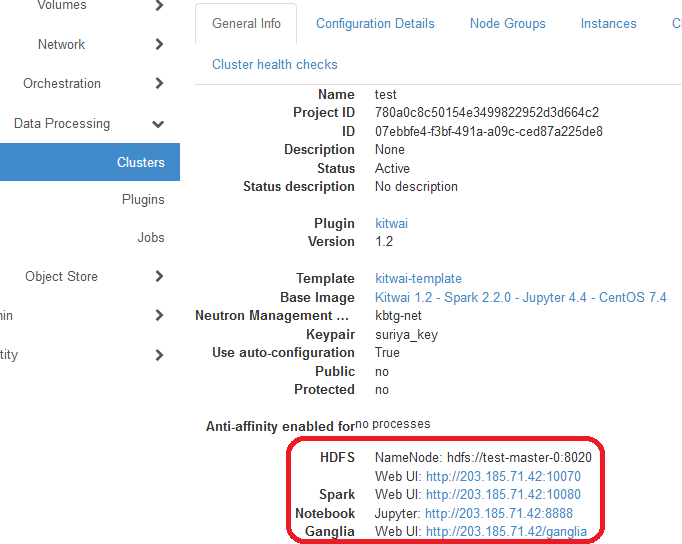
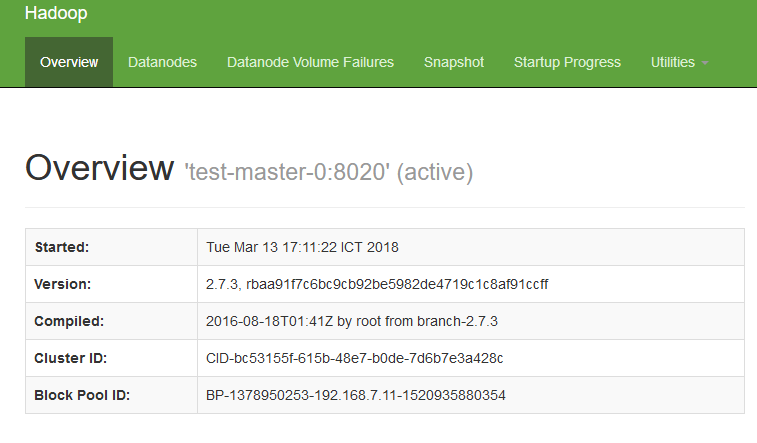
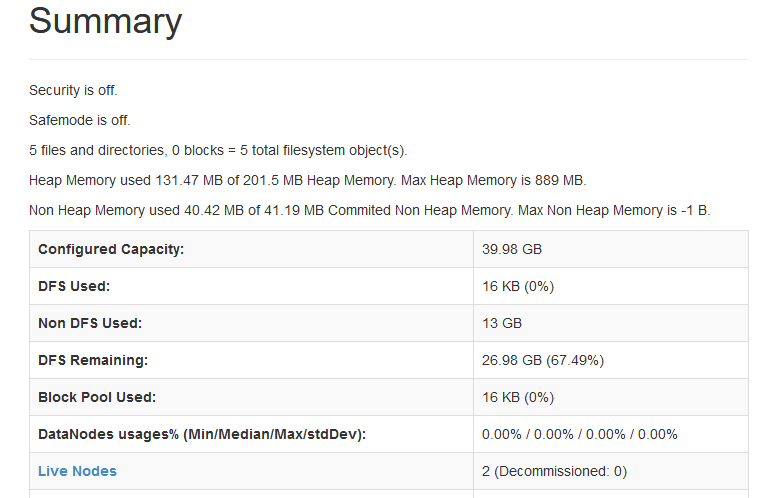
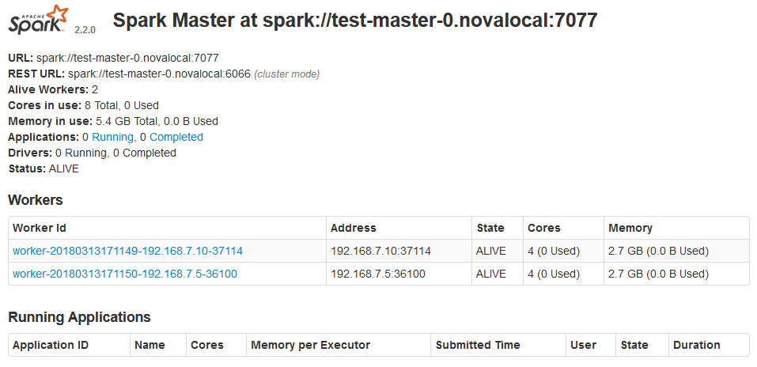
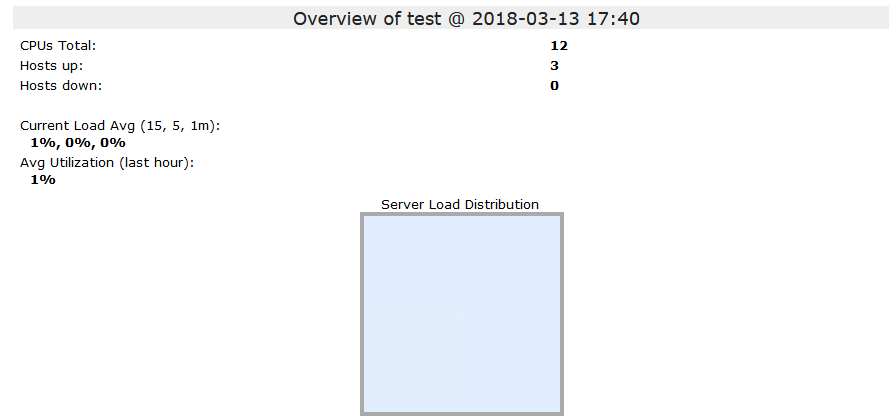
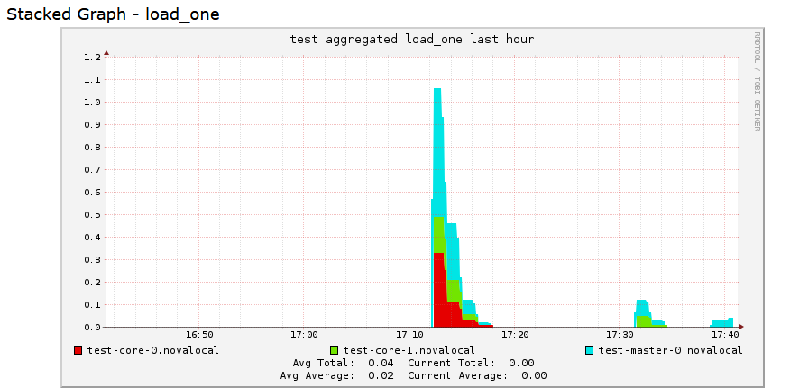
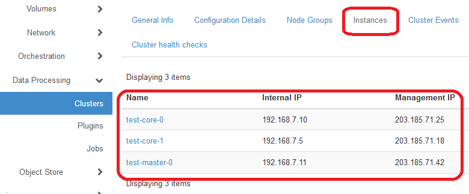

# Verify and Check Spark Cluster Status

Users can always check the status of a spark cluster as well as the service URLs (IPs and ports) started on the cluster.

1. On the Clusters page, click on the General Info tab. Users can see the general information of the cluster followed by the service URLs.

   

   ​

2. Click on the HDFS Web UI. A new web page is opened to show the Hadoop DFS (Distributed File System) health status.

   

   

   ​

3. Click on the Spark Web UI. Another web page is opened showing the spark cluster and job status.

   

   ​

4. Click on the Ganglia Web UI. A new web page is opened to show cluster resource utilization including CPU and memory usage. The information on the Ganglia Web UI is updated every 15 seconds by default.

   

   

5. Then, click on the Instances tab. The list of nodes is shown with the associated internal and management IP addresses. The internal IPs refer to the IP addresses used internally for the node to communicate. The management IPs are public IPs which can be accessible from the Internet (if the firewall rules allow). By default,  common TCP ports are allowed for incoming traffic, and all outgoing traffic are permitted. Notice the management IP of the master node. In the demo template, the master node is used as the client/login node.

   

   ​
