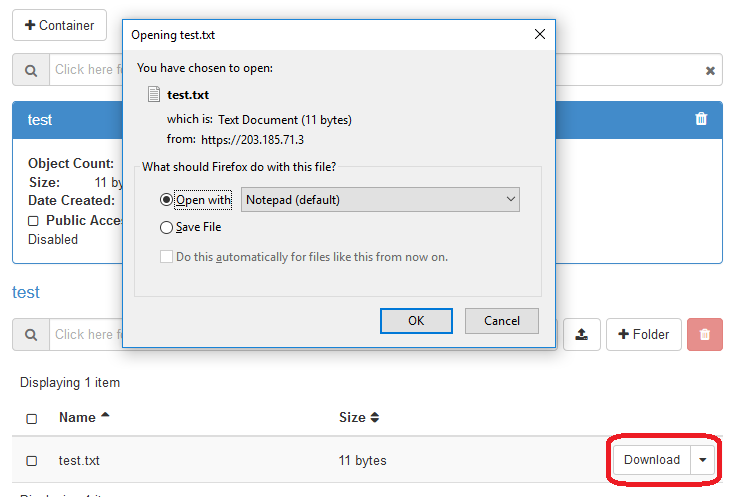

# Working with Data in Swift Object Storage
Openstack Swift is a cloud object storage. Swift stores arbitrary objects in specific namespaces,  called containers. Objects can be text, documents, images, or other types of files. A container is a place used to collect a set of objects, similar to a folder storing a set of files.

To store (import) and retrieve (export) files from Swift, several options are possible:
- Swift command line
- Web Interface
- GUI Client programs
- Directly from Spark programs

## Import/Export Swift Objects via Web Interface

### Import swift objects

- Login to KitWai platforms and go to containers page by clicking on Object Store menu then click on Containers menu.

  

  ​

- On Containers page, create a container by clicking on Container button.

  

  ​

- Create Container page will be pop up then enter container name as your desired and click on Submit button.

  

  ​

- After creating the container has succeeded, the container name will be shown on Containers page.

  

  ​

- Then click on container name, users will see container information and button for importing files and creating folder on the container.

  

  ​

- Import a file by clicking on upload file button.

  

  ​

- Upload File page will be popup, then click on Browse button and select a file that users want  upload to the container.  

  

  ​

- Then, click on Upload file button for importing a file to the container.

  

  ​

- After uploading has succeeded, the file which is uploaded  will be shown in list on container page.

  

  ​

- Import swift objects has succeeded.

### Export swift objects

- On container page, users can export a file from the container to users machine by clicking on download button on the filename that users want to download.

  

  ​

## Import/Export Swift Objects via GUI Clients
There exist tools running on Windows or Mac.

- CloudBerry Explorer for Openstack https://www.cloudberrylab.com/explorer.aspx

Click on File -> New Openstack Account. Put username, password and other information as follows.


Then, select kitwai to connect to swift service.


The containers under the default project are shown.


- Cyberduck https://cyberduck.io/

Click on File -> Open Connection. Put project, username, password and other information as follows.


The containers are shown.


## How to Access Swift Objects directly from Spark Programs

**Swift object storage is not supposed to be  the working area for data intensive jobs. Use HDFS instead.** 

Spark can access Swift objects via HDFS layer. The URL format of a Swift object is in the following form:

```
swift://container_name.sahara/path/file
```

For example, if an object _churn-bigml-80.csv_ is stored under container _mycontainer_ and path _/dataset/churn_, the URL would be

```
swift://mycontainer.sahara/dataset/churn/churn-bigml-80.csv
```
Wildcard can also be used, e.g.
```
swift://mycontainer.sahara/dataset/churn/churn-bigml-*.csv
```
To use a swift object in Spark, refer to its URL.

```python
train_data = sqlContext.read.load('swift://mycontainer.sahara/dataset/churn/churn-bigml-80.csv',
                        format='com.databricks.spark.csv',
                        header='true',
                        inferSchema='true')

train_data.cache()
train_data.printSchema()
```
