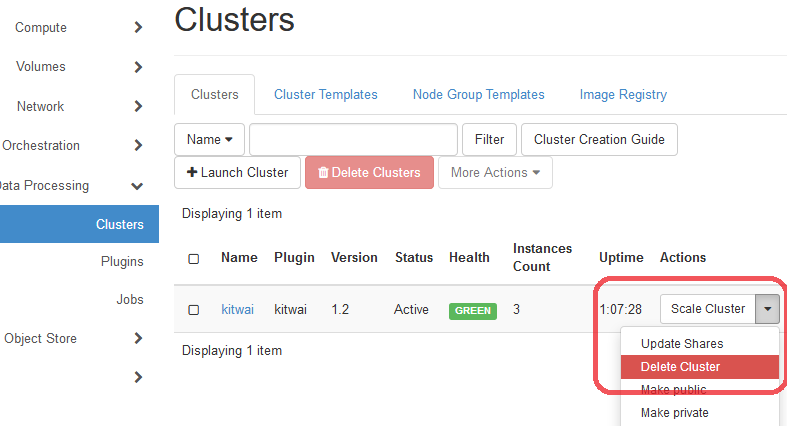
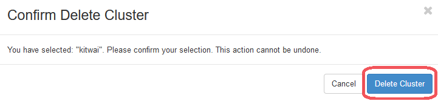
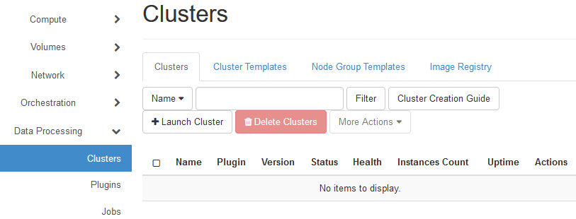

# Terminate a Spark Cluster

Please follow the instructions below on how to terminate a spark cluster.

1. On Clusters page, select Delete Cluster menu which is under actions drop down list on your cluster name.

   

   ​

2. The confirm delete cluster page will be pop up and then click on Delete Cluster button for deleting a cluster.

   

   ​

3. After deleting succeeded, the cluster is removed from clusters page.

   

   ​

4. A spark cluster has successfully deleted.