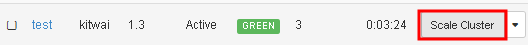
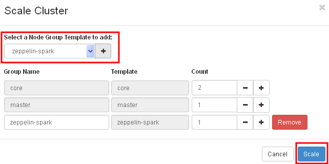
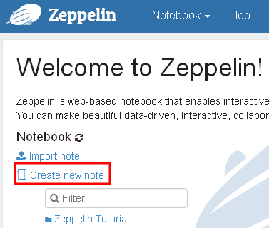
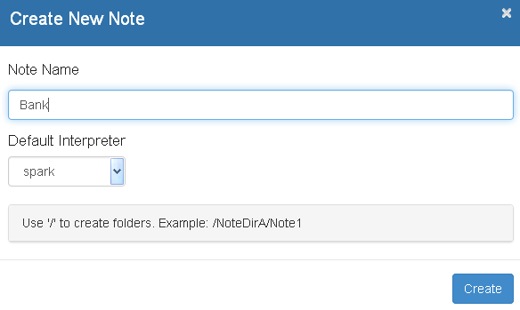
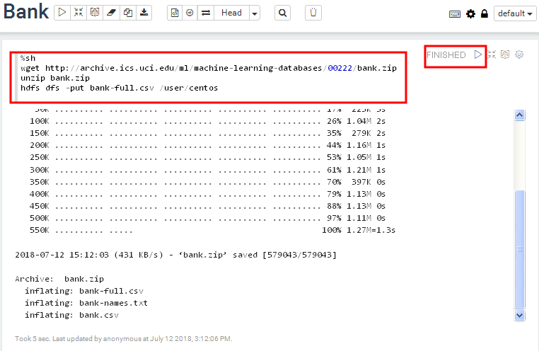
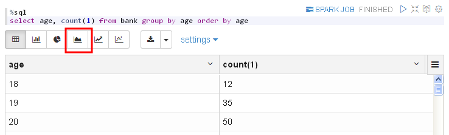
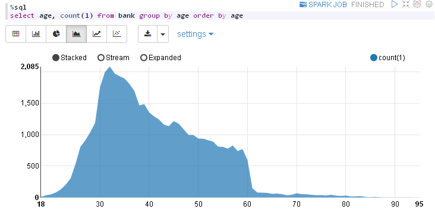
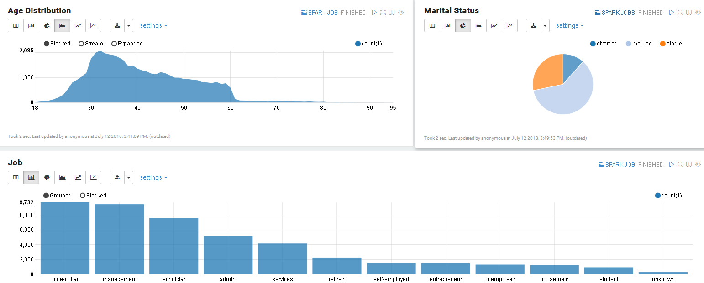

# Using Zeppelin Notebook for Spark

Zeppelin is a web-based notebook for interactive programming and data visualization in browser. It supports many programming languages via Zeppelin interpreters such as scala, python, R, SQL and Bash.

## Start a Zeppelin node
First, launch a spark cluster as described previously [here](../launchcluster/launchcluster.md). Then, click on the "Scale Cluster" button.



Add a zeppelin node group and click Scale.



After the cluster has finished scaling, click on the zeppelin URL to bring up the Zeppelin front page.

## Create a notebook
Let's create a new notebook.



Enter the note name, e.g. Bank and click Create.




## Load sample data
In the first paragraph, copy and paste the following line. Click on the play button and wait until the paragraph has finished executing. This paragraph executes commands in Bash shell (as denoted by %sh interpreter in the first line).

```shell
%sh
wget http://archive.ics.uci.edu/ml/machine-learning-databases/00222/bank.zip
unzip bank.zip
hdfs dfs -put bank-full.csv /user/centos
```


The sample data looks like:
```
"age";"job";"marital";"education";"default";"balance";"housing";"loan";"contact";"day";"month";"duration";"campaign";"pdays";"previous";"poutcome";"y"
58;"management";"married";"tertiary";"no";2143;"yes";"no";"unknown";5;"may";261;1;-1;0;"unknown";"no"
44;"technician";"single";"secondary";"no";29;"yes";"no";"unknown";5;"may";151;1;-1;0;"unknown";"no"
```

This sample data is from [UCI bank dataset](https://archive.ics.uci.edu/ml/datasets/bank+marketing).

## Read data and create a table in SparkSQL
In the next paragraph, **remove %sh in the first line** in order to use the default spark interpreter.

Copy the following code block and play this paragraph. The program will read the CSV file and create a "bank" table. It may take seconds to finish due to the overhead of creating a new Spark context. This example is adapted from [Zeppelin Tutorial](https://zeppelin.apache.org/docs/0.8.0/quickstart/tutorial.html).

```scala
val bankText = sc.textFile("/user/centos/bank-full.csv")

case class Bank(age:Integer, job:String, marital : String, education : String, balance : Integer)

// split each line, filter out header (starts with "age"), and map it into Bank case class
val bank = bankText.map(s=>s.split(";")).filter(s=>s(0)!="\"age\"").map(
    s=>Bank(s(0).toInt,
            s(1).replaceAll("\"", ""),
            s(2).replaceAll("\"", ""),
            s(3).replaceAll("\"", ""),
            s(5).replaceAll("\"", "").toInt
        )
)

// convert to DataFrame and create temporal table
bank.toDF().registerTempTable("bank")
```

## Query and create charts
Now, run the following SQL query in the next paragraph.
```sql
%sql
select age, count(1) from bank group by age order by age
```

The query result is shown in table by default.



Click on the Area Chart button to change the display of the result.



In the next paragraph, create a pie chart with the following query.
```sql
select marital, count(1) from bank group by marital
```

Then a bar chart with query:
```sql
select job, count(1) from bank group by job order by count(1) desc
```

We can adjust size and layout of the paragraphs as follows.


